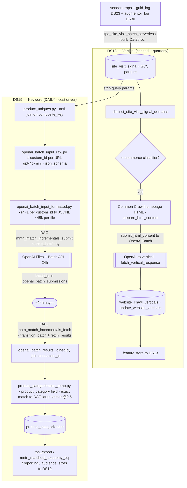

# MNTN Matched — DS13 (Vertical) & DS19 (Keyword) Pipeline

*Reference map of how vendor + internal site-visit data becomes the DS13 vertical and DS19 keyword targeting
signals, including every OpenAI touchpoint. Verified against `SteelHouse/shopper_graph` @ `4f0fc37` and
`SteelHouse/airflow-ti`.*

## Two legs, one input

Both data sources read **`site_visit_signal`** but run as separate flows with very different economics. Each uses its
own OpenAI **Batch API** job — DS13 classifies *homepages*, DS19 classifies *product URLs*.

| | DS13 — Vertical | DS19 — Keyword |
|---|---|---|
| Grain | domain → vertical/bucket | URL (query-stripped) → keyword (`data_source_category_id`) |
| OpenAI cadence | **every few months** (cached) | **daily** |
| Cost | low | **high — the cost driver** |
| OpenAI input | Common-Crawl homepage HTML/description | the product URL (+ name; homepage desc mostly disabled) |
| Output store | `website_crawl_verticals/` (~1.42M domains) | `product_categorization` → DS19 taxonomy |
| Code (primary) | `airflow-ti/spark/vertical_classification/*`, `dbt` `ml_squad/models/vertical_categorization/*` | `shopper_graph` `dbt/models/mntn_matched/*` + `openai/*` |

## Diagram

## Shared input — `site_visit_signal`
Vendor DDP drops (5x5/33Across/Predactiv/Cybba/Sovrn…) + internal `guid_log` (DS23) + `augmentor_log` (DS30) are
ingested hourly by `fpa_site_visit_batch_serverless` (Dataproc serverless; per-vendor Spark jobs
`airflow-ti/spark/fpa/dsid{NN}_*_processing.py`) into `gs://…/signals/site_visit_signal/dt=/hh=/data_source_id=`
(parquet; `ip, url, user_agent, time, data_source_id, …`). *Why:* one normalized substrate any consumer can read,
separable by source.

## DS13 — Vertical (cached, ~quarterly)
1. **Distinct domains** from `site_visit_signal` (`distinct_site_visit_signal_domains.py`, 31-day, excludes DS23).
2. **E-commerce classifier** → is-ecommerce yes/no — a cheap cutoff so only commercial domains are classified.
3. **Common-Crawl homepage HTML** fetched weekly (`fetch_common_crawl.py`, `prepare_html_content.py`) — a free, stable
   description of each domain; no need to crawl sites ourselves.
4. **OpenAI Batch** classifies homepage content → vertical (`submit_html_content.py` → `fetch_vertical_response.py`,
   which parses `predicted_subindustry`). Run only **every few months** because domain→vertical is slow-moving; daily
   re-runs would re-pay for heavy URL repetition.
5. **Store** `domain → vertical` (`update_website_verticals.py` → `website_crawl_verticals`) → feature store → DS13.
   *(DS13 historically reused the DS19 product flow's `industry` field; it no longer does.)*

## DS19 — Keyword (daily, the cost driver)
All `shopper_graph` `dbt/models/mntn_matched/` unless noted.
1. **`pre_batch/product_uniques.py`** — strip query params from each day's URLs (`product_name` = URL before `?`;
   `product_sku` hardcoded `1`; `composite_key = product_name_1`). **Anti-join on `composite_key`** vs stored uniques →
   only never-seen URLs proceed. Retains `data_source_id` for **billing attribution**.
2. **`pre_batch/openai_batch_input_raw.py`** — group by `(product_name, product_sku, domain)`,
   `collect_set(data_source_id)` → **one request per unique URL**; build the `gpt-4o-mini` request (strict `json_schema`:
   industry/sub-industry/**category**/sub-category; `max_tokens 1000`). Prompt: *"Identify the industry, sub-industry,
   category, and subcategory that the following product website falls into: Product Name… SKU… URL… [Website description…]"*.
3. **`pre_batch/openai_batch_input_formatted.py`** — keep `rn=1` per `custom_id` → JSONL (~45K requests/file).
4. **DAG `mntn_match_incrementals_submit`** — dbt prep → `submit_batch.py` → OpenAI Files + Batch API
   (`completion_window=24h`; batch_id persisted to GCS). *Why Batch API:* ~50% cheaper than sync; results aren't needed live.
5. **~24h async** → **DAG `mntn_match_incrementals_fetch`** (operates on yesterday): `transition_batch.py` (poll) →
   `fetch_results.py` (download). *Why two DAGs:* submission can't block on a 24h job.
6. **`post_batch/openai_batch_results_joined.py`** — parse response, join back on `custom_id`.
7. **`post_batch/product_categorization_temp.py`** — the **`product_category`** field becomes the DS19 keyword. Map it to
   a taxonomy `data_source_category_id`: (a) exact match vs `product_category_reassignment`; (b) else **vector search** —
   embed with **BGE-large** (`system.ai.bge_large_en_v1_5/3`, local/free), nearest-neighbor vs `etl_mm_taxonomy_vector_index`
   @ threshold 0.6 (e.g. "high top red shoes" → "shoes"). *(New-keyword auto-add is currently disabled — "post migration"
   TODO.)*
8. **`product_categorization`** → `tpa_export` / `mntn_matched_taxonomy_bq` / reporting / `audience_sizes` → DS19.

## `data_source_id` does not duplicate OpenAI requests
A URL is sent to OpenAI **once**, regardless of how many vendors reported it. Three dedup layers: `product_uniques`
anti-joins on `composite_key`; `openai_batch_input_raw` collapses to one `custom_id` per unique URL
(`collect_set(data_source_id)`); `openai_batch_input_formatted` keeps `rn=1` per `custom_id`. `data_source_id` is kept
only for **billing attribution**. The DS19 cost driver is the raw count of distinct path-level URLs.

## Known inefficiencies (DS19 keyword leg)
- `product_sku` is hardcoded to `1` → every prompt carries dead `" Product SKU:1"` tokens.
- Homepage-description enrichment is hardcoded to a single domain (`.isin([...])`) — effectively off elsewhere.
- The full instruction repeats per request (Batch API has no prompt caching); `max_tokens 1000` is generous for a 4-field JSON.
- BGE-large embedding is already in-pipeline and free → candidate to classify many URLs without the LLM.

## Where the code lives (5 repos)
- **`shopper_graph`** — `dbt/models/mntn_matched/*` (DS19), `openai/*` (Batch submit/fetch/transition + wrapper),
  `notebooks/*` (legacy GPT-3.5 product flow), `middleware/*` + `autopilot/*` (Flask/Lambda serving), `scripts/redis/*` (ops).
- **`airflow-ti`** — `dags/machine_learning/mntn_match_*` (DS19 orchestration), `spark/vertical_classification/*` +
  `dags/vertical_classification/*` + `dags/targeting/fetch_common_crawl.py` (DS13), `spark/fpa/*` (ingestion),
  `models/feature_store/*`, `include/dbx/*` (K8s operators).
- **`dbt`** — `ml_squad/models/vertical_categorization/*` (DS13), `ml_squad/models/reporting/targeted_signal_ds_{13,19}.py`.
- **`airflow`** — legacy/near-duplicate vertical-classification + site-visit jobs (confirm live-vs-deprecated).
- **`sqlmesh`** — `site_visit_signal` external-table definition.
