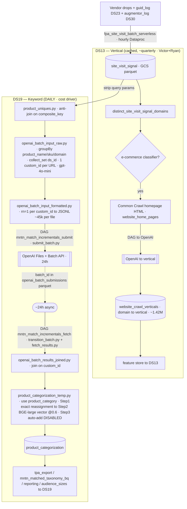

## TL;DR

**Q:** Read TI-1058 summary; produce the TL;DR card, delta_facts, and front-matter check for the DS13/DS19 (MNTN Matched) OpenAI pipeline map.

**A:** TI-1058 maps the DS13/DS19 (MNTN Matched / MM 2.0) OpenAI pipeline end-to-end: one verified mermaid diagram plus a ~95-file manifest across 5 repos. Both DSes read the shared site_visit_signal substrate but run as two separate flows with very different economics. DS13 (vertical) is domain-to-vertical, cached and refreshed roughly every few months (manual, Victor+Ryan) via Common Crawl homepage HTML to OpenAI to website_crawl_verticals (~1.42M domains). DS19 (keyword) is URL-to-keyword, run DAILY and is the OpenAI cost driver.

Resolved the ticket's #1 question: data_source_id does NOT multiply OpenAI cost. Dedup is on composite_key (query-stripped URL), so a URL is sent to OpenAI exactly once regardless of how many vendors report it; data_source_id is retained only for billing attribution (augmentor_log DS30 duplicate URLs are absorbed by the anti-join). The DS19 keyword = the OpenAI product_category field (gpt-4o-mini, Batch API, ~24h async), then snapped to the taxonomy via Step1 exact match vs product_category_reassignment and Step2 BGE-large vector search @ threshold 0.6; Step3 auto-add is currently COMMENTED OUT. The real DS19 cost driver is the sheer number of distinct path-level URLs.

Waste candidates handed to TI-1060: product_sku hardcoded to literal 1 (dead prompt tokens every request); homepage-description join hardcoded to only apollaperformance.com (enrichment effectively off elsewhere, likely leftover/test); missing prompt spaces; disabled taxonomy auto-add; free in-pipeline BGE-large as a candidate to replace gpt-4o-mini for many URLs. Status: in_progress; DS13 vertical leg now located; 19 remaining unknowns tracked in the manifest artifact.

**How:** Verified by primary-source reads at SteelHouse/shopper_graph commit 4f0fc37 plus a Ryan Kleck walkthrough (2026-06-26, meetings/ti_1058_01). Section 5 traces the anti-join (composite_key only) in product_uniques.py, the collect_set(data_source_id) with one-custom_id-per-URL groupBy in openai_batch_input_raw.py, and the row_number rn=1 collapse in openai_batch_input_formatted.py, concluding exactly one OpenAI request per unique URL. The manifest (section 4) is a completeness-gated GitHub sweep (222 raw hits to ~95 files), with the DS13 vertical leg located in airflow-ti/spark/vertical_classification and SteelHouse/dbt ml_squad/models/vertical_categorization. Per-row DS inference in the manifest is flagged unreliable; authoritative DS split is by leg, verified by primary reads.

**Tables:** site_visit_signal, website_crawl_verticals, product_categorization, product_uniques, openai_batch_input_raw, openai_batch_input_formatted, openai_batch_results_joined, product_categorization_temp, product_category_reassignment, etl_mm_taxonomy_vector_index, tpa_export, mntn_matched_taxonomy_bq, website_home_pages, site_visit_signal_advertiser_id_dsc_id

**Learned:**
- DS13 (vertical) and DS19 (keyword) share one input (site_visit_signal) but are two separate OpenAI flows: DS13 cached/refreshed ~every few months, DS19 daily and the cost driver
- data_source_id does NOT multiply OpenAI cost; dedup is on composite_key (query-stripped URL) so a URL is classified once regardless of vendor count; data_source_id kept only for billing attribution
- DS19 keyword = the OpenAI product_category field (of industry/subindustry/category/subcategory), via gpt-4o-mini Batch API ~24h
- Taxonomy mapping: Step1 exact match vs product_category_reassignment, Step2 BGE-large (bge_large_en_v1_5) vector search @ threshold 0.6; Step3 auto-add is currently COMMENTED OUT so sub-threshold categories are dropped
- The real DS19 cost driver is the number of distinct path-level URLs (product_name = URL minus query string)
- Known waste for TI-1060: product_sku hardcoded to 1, homepage-description join hardcoded to only apollaperformance.com, missing prompt spaces, disabled auto-add, free BGE-large as gpt-4o-mini replacement candidate
- DS13 vertical leg located: airflow-ti/spark/vertical_classification/* + dags/targeting/fetch_common_crawl.py + dags/vertical_classification/* + SteelHouse/dbt ml_squad/models/vertical_categorization/* (a separate OpenAI batch from DS19)

**Reuse when:**
- asked how MNTN Matched (MM 2.0) / DS13 / DS19 keywords are produced
- asked whether data_source_id causes duplicate OpenAI requests or drives OpenAI cost
- planning or scoping OpenAI cost optimization for the MM pipeline (TI-1060)
- asked which OpenAI output field becomes the DS19 keyword
- tracing site_visit_signal to product_categorization or website_crawl_verticals lineage

# TI-1058 — Document the DS13/DS19 (MNTN Matched) OpenAI Pipeline

**Jira:** [TI-1058](https://mntn.atlassian.net/browse/TI-1058) · **Blocks:** [TI-1060](https://mntn.atlassian.net/browse/TI-1060) (OpenAI cost optimization)
**Status:** In progress · **Source:** Ryan Kleck walkthrough 2026-06-26 (`meetings/ti_1058_01_ryan_ds_pipeline_2026_06_26.txt`)
**Primary code:** `SteelHouse/shopper_graph` @ `4f0fc3746f7fd0869cb50e006321023536e23062`, `SteelHouse/airflow-ti`

---

## 1. Introduction

MNTN Matched (MM 2.0) turns vendor + internal site-visit data into two targeting data sources:
- **DS13 — MNTN Vertical Categorization** (a.k.a. "Peak Performance" in product language): domain → vertical/bucket.
- **DS19 — MNTN Matched keywords**: URL → keyword (`data_source_category_id`) in our ~20K-keyword taxonomy.

Both are scored downstream by IPDSC into per-IP `household_score` and feed audience expressions. This ticket
produces a single, verified, end-to-end map of how that pipeline works: **every supporting GitHub file**, a
**mermaid diagram**, and a **step-by-step "why each tool" writeup** — to the standard of explaining a pipeline we own.

The two DSes share one input (`site_visit_signal`) but run as **two different flows with very different
economics**:

| | DS13 — Vertical | DS19 — Keyword |
|---|---|---|
| Grain | domain → vertical | URL (path) → keyword |
| OpenAI cadence | **every few months** (manual, Victor + Ryan) | **daily** |
| Cost | low, cached | **high — the cost driver** |
| Enrichment | Common Crawl homepage HTML | the URL itself (+ homepage desc, mostly disabled) |
| Stored result | `website_crawl_verticals/` (~1.42M domains) | `product_categorization` |

---

## 2. The Problem / motivation

1. **No single picture exists.** The pipeline is split across `shopper_graph` (dbt + an `openai/` job dir) and
   `airflow-ti` (DAGs), possibly more. Ryan: *"our code is kind of scattered all over… I don't even know what
   repo this runs in anymore"* / *"probably one of our most complex pipelines."* Ryan linked only ~6 files.
2. **OpenAI cost is high and likely reducible** → tracked separately in [TI-1060](https://mntn.atlassian.net/browse/TI-1060).
   Ryan: *"very expensive"* … *"if we could tell leadership we could cut our OpenAI costs by half, that would make
   them pretty happy."* This (DS13/DS19 keywords) is also the natural precursor to the **DAR** keyword work picked
   up next, and overlaps Alex Knorr's advertiser-keyword work.

---

## 3. The pipeline (verified)

### Shared input — `site_visit_signal`
Vendor drops (5x5, 33Across, Predactiv, Cybba, Sovrn…) + internal `guid_log` (DS23) + `augmentor_log` (DS30, added
~Apr 2026) → `fpa_site_visit_batch_serverless` (airflow-ti, hourly Dataproc serverless) →
**`gs://mntn-data-archive-prod/signals/site_visit_signal/dt=/hh=/data_source_id=`** (GCS parquet; schema
`uid, advertiser_id, ip, url, query_parameters, user_agent, time, data_source_id, dt, hh`). No TTL; targeting uses
the last ~30 days. *Why:* one normalized substrate keyed on (ip, url, time) that any consumer can read, separable
by `data_source_id`.

### DS13 — Vertical (cached, refreshed ~quarterly)
1. Distinct domains from `site_visit_signal` (`distinct_site_visit_signal_domains.py`, 31-day read, excludes DS23).
2. **E-commerce classifier** on each URL → is-ecommerce yes/no. *Why:* a cheap cutoff so we only pay to classify
   commercial domains (Malachi's TI-200 block/whitelist thresholds live here).
3. For e-commerce domains, fetch **homepage HTML from Common Crawl** (`website_home_pages`). *Why:* the homepage is a
   stable, free description of what the domain sells — no need to crawl the site ourselves.
4. A DAG submits homepage content to **OpenAI → returns a vertical**. ~"a few million requests", run **every few
   months** by Victor + Ryan — *not* daily. *Why batch + cached:* the domain→vertical map is slow-moving, so we pay
   once and store it; re-running daily would be "ridiculous" (Ryan) given heavy URL repetition.
5. Store domain→vertical: `gs://mntn-data-archive-prod/vertical_categorizations/website_crawl_verticals/`
   (`domain_name, vertical_id, vertical_name, bucket_id`; ~1.42M domains) → feature store
   `site_visit_signal_advertiser_id_dsc_id` → **DS13**.

> Note (Ryan): DS13 *used to* use the same product/keyword flow below (it consumed the `industry` field) but **no
> longer does** — DS13 today is the domain→vertical homepage-classification path above.
> **DS13-leg code located (§4):** `airflow-ti/spark/vertical_classification/{distinct_site_visit_signal_domains,
> prepare_html_content,submit_html_content,fetch_vertical_response,update_website_verticals}.py`,
> `airflow-ti/dags/targeting/fetch_common_crawl.py`, `airflow-ti/dags/vertical_classification/*`, and
> `SteelHouse/dbt` `ml_squad/models/vertical_categorization/*`. It is a **separate OpenAI batch** from DS19.

### DS19 — Keyword (daily, the cost driver)
All files below are `SteelHouse/shopper_graph` `dbt/models/mntn_matched/` unless noted.

1. **`pre_batch/product_uniques.py`** (incremental, append; `unique_key=composite_key`; partition `dt`).
   Reads `site_visit_signal/dt={run_date}` (one day). Renames `url`→`product_referrer`; parses `domain`
   (`urlparse().hostname`); emails the team via SendGrid on unparseable URLs.
   - `product_name` = URL **with query string stripped** (`split(url, "?")[0]`); `product_sku` = **literal `1`**
     (hardcoded); `composite_key` = `product_name + "_1"`. *Why "product":* legacy naming — these used to be true
     product URLs; now `product_uniques` just means "unique URL minus query params" (Ryan).
   - `current_uniques` = `GROUP BY uid, advertiser_id, product_name, product_sku, product_referrer,
     data_source_id, domain`.
   - **Anti-join vs stored `product_uniques` ON `composite_key` only** → only never-seen URLs proceed.
   - `write_df` = `groupBy(unique_id, product_name, product_sku, domain, data_source_id)` → stored. **`data_source_id`
     is kept here for billing attribution** (which vendor reported the URL), not to drive OpenAI volume.
2. **`pre_batch/openai_batch_input_raw.py`** (incremental; `unique_key=custom_id`).
   - Reads today's `product_uniques`, **anti-joins again** vs history (`dt < run_date`) on `composite_key`; optionally
     unions `product_uniques_to_reprocess/dt={run_date}`.
   - Homepage descriptions: reads `vertical_categorizations/website_home_pages` **filtered
     `.isin(["apollaperformance.com"])`** → only that one domain gets a description (looks like a leftover/test
     hardcode; homepage enrichment is effectively OFF for everything else — see §6).
   - **`batch_df = groupBy("product_name","product_sku","domain").agg(first(product_referrer),
     collect_set(data_source_id) AS ds_ids)`** → **one row, one `custom_id` (`request-<monotonic_id>`) per unique
     URL/product/domain.** Then `explode(ds_ids)` re-expands per data source (same `custom_id`, same prompt) so the
     join table can retain `data_source_id`.
   - Builds the OpenAI request: `model=gpt-4o-mini`, `max_tokens=1000`, `url=/v1/chat/completions`, strict
     `json_schema` (`product_industry, product_subindustry, product_category, product_subcategory`).
   - **Verbatim prompt:** `Identify the industry, sub-industry, category, and subcategory that the following product
     website falls into:  Product Name: <name> Product SKU:<sku> Product URL:<url>[ Website description: <desc>]`
3. **`pre_batch/openai_batch_input_formatted.py`** (materialized **table**, `file_format=json`).
   `row_number().over(partitionBy(custom_id) orderBy url desc) WHERE rn=1` → **exactly one request per `custom_id`**,
   selects only `custom_id, method, url, body` (extra cols would break the OpenAI batch file). → JSONL on GCS,
   ~45K requests/file (Ryan). **This collapse is the key dedup — see §5.**
4. **DAG `mntn_match_incrementals_submit`** (airflow-ti `dags/machine_learning/`): cleanup →
   `product_uniques` → `openai_batch_input_raw` → `openai_batch_input_formatted` → validate (dbt test) →
   **`submit_batch.py`** (OpenAI **Files API + Batch API**, `completion_window=24h`; batch_id persisted to
   `openai_batch_submissions/dt=/…parquet`) → cleanup. *Why Batch API:* ~50% cheaper than sync and we don't need
   real-time results.
5. **~24h async wait** (OpenAI Batch SLA, sometimes longer). *Why two DAGs:* submission can't block on a 24h job, so
   submit and fetch are separate daily DAGs; fetch operates on **yesterday's** batch_ids.
6. **DAG `mntn_match_incrementals_fetch`** (airflow-ti): cleanup → **`transition_batch.py`** (poll status) →
   **`fetch_results.py`** (download results JSONL → `openai_batch_results/dt=/`) → dbt post_batch (below) → tests → cleanup.
7. **`post_batch/openai_batch_results_joined.py`** — parses the OpenAI JSON response via a UDF, **joins results back
   to `openai_batch_input_raw` on `custom_id`**; keeps `response, product_name, product_sku, data_source_id, domain,
   composite_key`.
8. **`post_batch/product_categorization_temp.py`** (delta) — the vector-map step:
   - `from_json(response…message.content)` → the 4 fields; **DS19 keyword = the `product_category` field**
     (lowercased; length-guarded). *(Resolves Ryan's "sub-industry or sub-category?" — it's `product_category`.)*
   - `keywords_df` = `groupBy(product_category)`, `count_distinct(composite_key)` = `composite_key_count`.
   - **Step 1 — exact match** of `product_category` vs `product_category_reassignment` (+ `taxonomy_new_mappings`
     rollups) → `dsc_id` (source `product_category_reassignment`).
   - **Step 2 — vector search** for the rest: embed `product_category` with **`system.ai.bge_large_en_v1_5/3`**
     (BGE-large, 1024-dim, local Databricks Unity Catalog — **free**), normalize, `similarity_search` vs
     **`etl_mm_taxonomy_vector_index`** (holds our taxonomy), `num_results=1`, **threshold 0.6** → `dsc_id`
     (source `vector_search`). *Why:* OpenAI returns free-text keywords not in our taxonomy (e.g. "high top red
     shoes"); the vector index snaps them to the nearest existing keyword ("shoes").
   - **Step 3 — auto-add new keywords: currently COMMENTED OUT** ("TODO: switch on post migration"). The
     `add_keyword_to_index()` function exists (threshold `composite_key_count >= 5`) but is disabled, so categories
     not matched in Steps 1–2 are dropped (no new `dsc_id`). *(This is the "Victor adds keywords if it shows up ~500×"
     behavior Ryan described — intended, but OFF in this commit.)*
9. **`post_batch/product_categorization.py`** (final) → `taxonomy/mntn_matched_taxonomy_bq` (BQ export),
   `tpa_export` (ip → `data_source_category_id`), `reporting/mntn_matched_reporting`, `audience_sizes` → **DS19** in
   IPDSC / audience expressions.

### Diagram (verified)

---

## 4. Complete file manifest

**Full manifest → `artifacts/ti_1058_file_manifest.md`** (multi-angle, completeness-gated GitHub sweep, 2026-06-26).
**222 raw hits → ~95 distinct files across 5 repos**, grouped into 16 data-flow steps (Step 0 ingestion → Step 15
docs). Raw-hit counts: `shopper_graph` 157, `airflow-ti` 52, `dbt` 5, `airflow` 5 (legacy), `workspace` 2, `sqlmesh` 1.
> The manifest's per-row `DS` column is discovery-agent inference and is **unreliable** — the authoritative DS split is
> by leg (below), verified by primary reads in §3/§5.

**The DS13 vertical leg — now located** (earlier exploration couldn't pin it). It's a **separate OpenAI batch** from
DS19, classifying *homepages* not product URLs:
- `airflow-ti/spark/vertical_classification/`: `distinct_site_visit_signal_domains.py`, `prepare_html_content.py`,
  `submit_html_content.py`, `fetch_vertical_response.py` (parses `predicted_subindustry`), `update_website_verticals.py`
- `airflow-ti/dags/targeting/fetch_common_crawl.py` (weekly Common-Crawl homepage HTML)
- `airflow-ti/dags/vertical_classification/vertical_classification_{submit,fetch}.py`
- `SteelHouse/dbt` `ml_squad/models/vertical_categorization/*` (`common_crawl_home_page_content`, `ddp_url_verticals`,
  `ddp_vertical_classification_api`) → writes `website_crawl_verticals` → feature store.

**Also surfaced beyond the core pipeline:** a serving runtime (`middleware/k8s/api.py` Flask + `shopper_graph_wrapper/*`,
plus `autopilot/` and a vector-search Lambda) backed by Postgres/Redis (`/autopilot`, `/search_term`, `/vertical`,
`/domain_map` endpoints); legacy `notebooks/` (the *original* GPT-3.5-turbo product flow); and the **`SteelHouse/airflow`
repo as an older duplicate** of the vertical-classification jobs — live-vs-deprecated must be confirmed.

**19 remaining unknowns** are listed in the artifact — notably: per-vendor DDP ingestion DS24/27/33/39/40; the
e-commerce-classifier code; the `household_score` writer; the `website_crawl_verticals` DDL; the airflow vs airflow-ti
live/deprecated split; and the taxonomy auto-add "≥500×" rule.

_High-confidence core, confirmed by primary read (commit `4f0fc37`):_

| Step | Repo | Path | Purpose |
|---|---|---|---|
| DS19 prep | shopper_graph | `dbt/models/mntn_matched/pre_batch/product_uniques.py` | URL→unique (strip query params), anti-join on composite_key, store with data_source_id (billing) |
| DS19 prep | shopper_graph | `dbt/models/mntn_matched/pre_batch/product_uniques_to_reprocess.py` | reprocess queue (filtered uniques) |
| DS19 batch in | shopper_graph | `dbt/models/mntn_matched/pre_batch/openai_batch_input_raw.py` | build gpt-4o-mini batch request (prompt + json_schema); one custom_id per URL |
| DS19 batch in | shopper_graph | `dbt/models/mntn_matched/pre_batch/openai_batch_input_formatted.py` | rn=1 per custom_id → JSONL batch file |
| DS19 batch out | shopper_graph | `dbt/models/mntn_matched/post_batch/openai_batch_results_joined.py` | parse OpenAI JSON, join to input on custom_id |
| DS19 vector map | shopper_graph | `dbt/models/mntn_matched/post_batch/product_categorization_temp.py` | product_category → dsc_id (exact + BGE-large vector @0.6; auto-add disabled) |
| DS19 final | shopper_graph | `dbt/models/mntn_matched/post_batch/product_categorization.py` | final product→category mapping |
| DS19 taxonomy | shopper_graph | `dbt/models/mntn_matched/taxonomy/{mntn_matched_taxonomy,mntn_matched_taxonomy_vector,mntn_matched_taxonomy_bq,taxonomy_vector,taxonomy_vector_source}.py` | taxonomy registry + vector index population/sync + BQ export |
| DS19 outputs | shopper_graph | `dbt/models/mntn_matched/{tpa_export,audience_sizes}.py`, `reporting/mntn_matched_reporting.py`, `advertiser_verticals/verticals_vector_source.py` | ip→dsc_id export, audience sizes, reporting, advertiser verticals |
| OpenAI job dir | shopper_graph | `openai/{submit_batch,fetch_results,transition_batch,delete_all_storage_files}.py` + `openai/openai_wrapper/*` | Batch API submit/poll/fetch/cleanup |
| Orchestration | airflow-ti | `dags/machine_learning/mntn_match_incrementals_submit.py` | daily: dbt prep → submit batch |
| Orchestration | airflow-ti | `dags/machine_learning/mntn_match_incrementals_fetch.py` | daily: fetch (yesterday) → post_batch dbt |
| Config | shopper_graph | `dbt/dbt_project.yml` | `llm_mm_taxonomy_lookup` (bge_large embedding model, vector index FQN), location_root |

---

## 5. Resolved: does `data_source_id` cause duplicate OpenAI requests?

**No.** This was Malachi's #1 question and Ryan's on-call uncertainty ("ask Claude"). Primary-source trace at
commit `4f0fc37`:

1. `product_uniques.py` — the incremental **anti-join is on `composite_key` only** (`current_uniques.join(uniques_df,
   ["composite_key"], "anti")`), not `data_source_id`. So already-classified URLs never re-enter, regardless of source.
2. `openai_batch_input_raw.py` — **`groupBy("product_name","product_sku","domain").agg(collect_set("data_source_id")
   AS ds_ids)`** ⇒ **one `custom_id` per unique URL/product/domain**. The later `explode(ds_ids)` only re-attaches
   `data_source_id` for the join table; every exploded row shares the same `custom_id` and identical prompt `content`.
3. `openai_batch_input_formatted.py` — **`row_number() … partitionBy(custom_id) … WHERE rn=1`** collapses back to
   **one row per `custom_id`** before the batch file is written.

⇒ **Exactly one OpenAI request per unique (query-stripped) URL**, no matter how many vendors reported it.
`data_source_id` is retained purely to attribute the URL to its source vendor(s) for **billing**. Ryan's live
"never mind — it does the anti-join on composite key" is correct. The augmentor_log (DS30) duplicate-URL concern is
already absorbed by the composite_key dedup.

**The real DS19 cost driver is the sheer number of distinct path-level URLs** (`product_name` = full URL minus query
string) — "very unique URLs… we send a lot of them" (Ryan). Optimization levers therefore target URL volume, prompt
size, and model/approach, not data_source_id — see [TI-1060](https://mntn.atlassian.net/browse/TI-1060).

---

## 6. Investigation findings feeding TI-1060 (verified, with code evidence)

1. **`product_sku` is hardcoded to literal `1`** (`product_uniques.py`), so every prompt carries `" Product SKU:1"` —
   dead tokens that convey nothing (× every request). Ryan noticed this live ("I don't know why we give a product
   skew these tokens").
2. **Homepage-description join is hardcoded to `.isin(["apollaperformance.com"])`** (`openai_batch_input_raw.py`) —
   the "Website description" enrichment is effectively OFF for all other domains. Either a leftover/test hardcode (dead
   code) or a regression that removed useful context from DS19 classification. Decide: re-enable broadly vs remove.
3. **Prompt has missing spaces** (`" Product SKU:"`, `" Product URL:"` with no trailing space). Cheap to fix; Ryan
   flagged a possible quality effect.
4. **Vector auto-add (Step 3) is disabled** (`product_categorization_temp.py`, commented "post migration" TODO) →
   taxonomy isn't growing; sub-threshold categories are dropped. Quality + coverage implication.
5. **Local embedding already in-pipeline & free** (BGE-large). Biggest lever: test embedding the product/URL text and
   nearest-neighbor straight into the taxonomy, skipping gpt-4o-mini for many/most URLs.
6. **`max_tokens=1000`** is generous for a tiny 4-field JSON; the full instruction repeats per request (Batch API,
   no prompt caching).
7. **Accuracy is uneven** — Ryan's live example: a soccer-news URL classified as "online content/publications" (the
   vector map degraded it). Worth a ~100-row QA on `prod.mntn_matched.product_categorization`.

---

## 7. Solution / deliverables (this ticket)
- This `summary.md` (analytical record) + the verified mermaid diagram above.
- Complete file manifest (§4) once the discovery sweep returns.
- A shareable copy in `documentation/architecture/`.
- Hand-off of the optimization candidates to [TI-1060](https://mntn.atlassian.net/browse/TI-1060).

## 8. Questions answered
- **Q: Are we re-sending the same URL to OpenAI once per `data_source_id`?** A: No — see §5.
- **Q: Which OpenAI output field becomes the DS19 keyword?** A: `product_category` (§3 step 8).
- **Q: Is DS13 re-classified daily?** A: No — domain→vertical is cached, refreshed ~every few months (§3).
- **Q: Does DS13 use this same OpenAI keyword flow?** A: Not anymore — it used the `industry` field historically; now
  it's the Common-Crawl homepage→vertical path.

## 9. Open items
- **Manifest delivered** (`artifacts/ti_1058_file_manifest.md`, ~95 files / 5 repos); DS13 vertical leg located. ✅
- Work the artifact's **19 remaining unknowns** (per-vendor DDP ingestion DS24/27/33/39/40; e-commerce-classifier code;
  `household_score` writer; `website_crawl_verticals` DDL; airflow vs airflow-ti live/deprecated; taxonomy auto-add
  ≥500× rule).
- Confirm the active embedding model (config = `bge_large_en_v1_5`; a commented validation references `gte-large-en-v1.5`).
- Confirm submit/fetch DAG schedules + exact `submit_batch.py`/`fetch_results.py` internals.
- People: **Victor** (Common Crawl refresh, taxonomy auto-add rules), **Alex Knorr** (advertiser keywords / DAR).

## 10. Data documentation updates
- `knowledge/data_knowledge.md` — reconciled DS13 (cached) vs DS19 (daily) flow; `data_source_id` = billing attribution
  (not OpenAI multiplier); DS19 keyword = OpenAI `product_category`; vector auto-add currently disabled. *(pending)*
