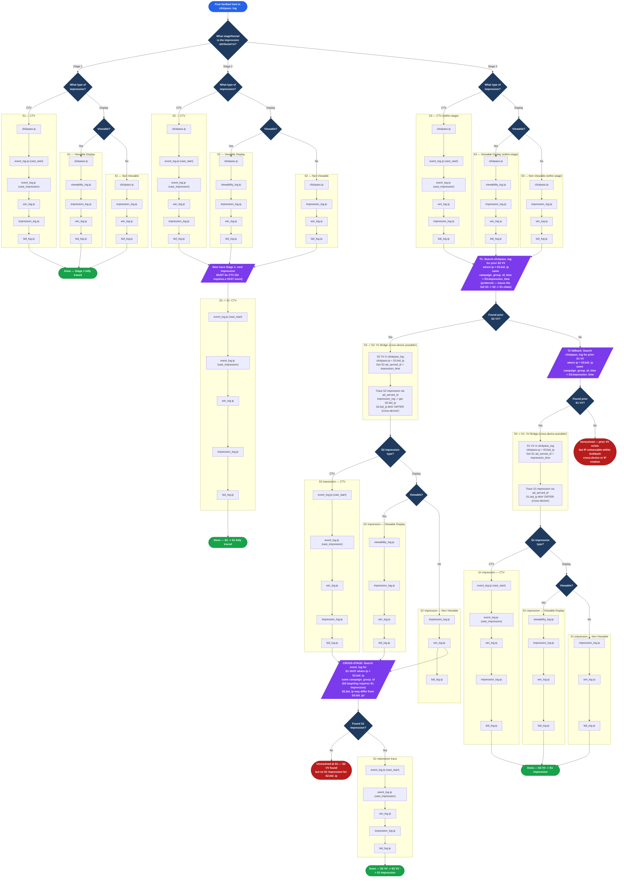

# VV IP Trace Flowchart

```mermaid
flowchart TD
    START([Find Verified Visit in clickpass_log]) --> STAGE{What stage/funnel<br/>is the impression<br/>attributed to?}

    STAGE -->|Stage 1| S1_TYPE{What type of<br/>impression?}
    STAGE -->|Stage 2| S2_TYPE{What type of<br/>impression?}
    STAGE -->|Stage 3| S3_TYPE{What type of<br/>impression?}

    %% ============================================================
    %% STAGE 1 TRACES
    %% ============================================================
    S1_TYPE -->|CTV| S1_CTV
    S1_TYPE -->|Display| S1_DISP_VIEW{Viewable?}

    subgraph S1_CTV_PATH ["S1 — CTV"]
        S1_CTV[clickpass.ip] --> S1_CTV_2["event_log.ip (vast_start)"]
        S1_CTV_2 --> S1_CTV_2b["event_log.ip (vast_impression)"]
        S1_CTV_2b --> S1_CTV_3[win_log.ip]
        S1_CTV_3 --> S1_CTV_4[impression_log.ip]
        S1_CTV_4 --> S1_CTV_5[bid_log.ip]
    end

    S1_DISP_VIEW -->|Yes| S1_DV
    S1_DISP_VIEW -->|No| S1_DNV

    subgraph S1_DV_PATH ["S1 — Viewable Display"]
        S1_DV[clickpass.ip] --> S1_DV_2[viewability_log.ip]
        S1_DV_2 --> S1_DV_2b[impression_log.ip]
        S1_DV_2b --> S1_DV_3[win_log.ip]
        S1_DV_3 --> S1_DV_4[bid_log.ip]
    end

    subgraph S1_DNV_PATH ["S1 — Non-Viewable"]
        S1_DNV[clickpass.ip] --> S1_DNV_2[impression_log.ip]
        S1_DNV_2 --> S1_DNV_3[win_log.ip]
        S1_DNV_3 --> S1_DNV_4[bid_log.ip]
    end

    S1_CTV_5 --> DONE1([Done — Stage 1 fully traced])
    S1_DV_4 --> DONE1
    S1_DNV_4 --> DONE1

    %% ============================================================
    %% STAGE 2 TRACES
    %% ============================================================
    S2_TYPE -->|CTV| S2_CTV
    S2_TYPE -->|Display| S2_DISP_VIEW{Viewable?}

    subgraph S2_CTV_PATH ["S2 — CTV"]
        S2_CTV[clickpass.ip] --> S2_CTV_2["event_log.ip (vast_start)"]
        S2_CTV_2 --> S2_CTV_2b["event_log.ip (vast_impression)"]
        S2_CTV_2b --> S2_CTV_3[win_log.ip]
        S2_CTV_3 --> S2_CTV_4[impression_log.ip]
        S2_CTV_4 --> S2_CTV_5[bid_log.ip]
    end

    S2_DISP_VIEW -->|Yes| S2_DV
    S2_DISP_VIEW -->|No| S2_DNV

    subgraph S2_DV_PATH ["S2 — Viewable Display"]
        S2_DV[clickpass.ip] --> S2_DV_2[viewability_log.ip]
        S2_DV_2 --> S2_DV_2b[impression_log.ip]
        S2_DV_2b --> S2_DV_3[win_log.ip]
        S2_DV_3 --> S2_DV_4[bid_log.ip]
    end

    subgraph S2_DNV_PATH ["S2 — Non-Viewable"]
        S2_DNV[clickpass.ip] --> S2_DNV_2[impression_log.ip]
        S2_DNV_2 --> S2_DNV_3[win_log.ip]
        S2_DNV_3 --> S2_DNV_4[bid_log.ip]
    end

    S2_CTV_5 --> S2_PREV[/"Now trace Stage 1: next impression<br/>MUST be CTV (S2 requires a VAST event)"/]
    S2_DV_4 --> S2_PREV
    S2_DNV_4 --> S2_PREV

    subgraph S2_S1_PATH ["S2 -> S1: CTV"]
        S2P_CTV_2["event_log.ip (vast_start)"] --> S2P_CTV_2b["event_log.ip (vast_impression)"]
        S2P_CTV_2b --> S2P_CTV_3[win_log.ip]
        S2P_CTV_3 --> S2P_CTV_4[impression_log.ip]
        S2P_CTV_4 --> S2P_CTV_5[bid_log.ip]
    end

    S2_PREV --> S2P_CTV_2
    S2P_CTV_5 --> DONE2([Done — S2 -> S1 fully traced])

    %% ============================================================
    %% STAGE 3 TRACES
    %% Key insight: S3 targeting is VV-BASED, not impression-based.
    %% To enter S3, the IP must have had a prior S1 or S2 VERIFIED VISIT.
    %% The cross-stage link is: S3.bid_ip -> clickpass_log.ip (prior S1/S2 VV)
    %% NOT S3.bid_ip -> event_log.ip (which was the old, wrong path).
    %% In cross-device scenarios, S2 VV ip != S2 impression ip.
    %% ============================================================
    S3_TYPE -->|CTV| S3_CTV
    S3_TYPE -->|Display| S3_DISP_VIEW{Viewable?}

    subgraph S3_CTV_PATH ["S3 — CTV (within-stage)"]
        S3_CTV[clickpass.ip] --> S3_CTV_2["event_log.ip (vast_start)"]
        S3_CTV_2 --> S3_CTV_2b["event_log.ip (vast_impression)"]
        S3_CTV_2b --> S3_CTV_3[win_log.ip]
        S3_CTV_3 --> S3_CTV_4[impression_log.ip]
        S3_CTV_4 --> S3_CTV_5[bid_log.ip]
    end

    S3_DISP_VIEW -->|Yes| S3_DV
    S3_DISP_VIEW -->|No| S3_DNV

    subgraph S3_DV_PATH ["S3 — Viewable Display (within-stage)"]
        S3_DV[clickpass.ip] --> S3_DV_2[viewability_log.ip]
        S3_DV_2 --> S3_DV_2b[impression_log.ip]
        S3_DV_2b --> S3_DV_3[win_log.ip]
        S3_DV_3 --> S3_DV_4[bid_log.ip]
    end

    subgraph S3_DNV_PATH ["S3 — Non-Viewable (within-stage)"]
        S3_DNV[clickpass.ip] --> S3_DNV_2[impression_log.ip]
        S3_DNV_2 --> S3_DNV_3[win_log.ip]
        S3_DNV_3 --> S3_DNV_4[bid_log.ip]
    end

    %% ---- CROSS-STAGE: S3 -> prior VV via clickpass_log ----
    %% S3 targeting is VV-BASED: the IP entered S3 because it had a
    %% prior verified visit on an S1 OR S2 campaign in the same
    %% campaign_group. Search clickpass_log for that prior VV.
    %% PRIORITY: Try S2 VV first (full chain). Fall back to S1 VV only if no S2 VV found.
    S3_CTV_5 --> S3_T1[/"T1: Search clickpass_log for prior S2 VV<br/>where ip = S3.bid_ip<br/>same campaign_group_id, time < S3.impression_time<br/>(preferred — traces the full S3 -> S2 -> S1 chain)"/]
    S3_DV_4 --> S3_T1
    S3_DNV_4 --> S3_T1

    S3_T1 --> S3_S2_FOUND{Found prior<br/>S2 VV?}

    S3_S2_FOUND -->|Yes| S3_S2_VV

    %% ---- FALLBACK: No S2 VV -> try S1 VV directly ----
    S3_S2_FOUND -->|No| S3_T2[/"T2 fallback: Search clickpass_log for prior S1 VV<br/>where ip = S3.bid_ip<br/>same campaign_group_id, time < S3.impression_time"/]

    S3_T2 --> S3_S1_FOUND{Found prior<br/>S1 VV?}

    S3_S1_FOUND -->|Yes| S3_S1_VV
    S3_S1_FOUND -->|No| UNRESOLVED([Unresolved — prior VV exists<br/>but IP untraceable within lookback<br/>cross-device or IP rotation])

    %% ---- PATH A: Prior VV was S2 -> trace S2 impression -> then S1 ----
    subgraph S3_S2_BRIDGE ["S3 -> S2: VV Bridge (cross-device possible!)"]
        S3_S2_VV["S2 VV in clickpass_log<br/>clickpass.ip = S3.bid_ip<br/>Get S2 ad_served_id + impression_time"]
        --> S3_S2_TRACE["Trace S2 impression via ad_served_id<br/>impression_log -> get S2.bid_ip<br/>S2.bid_ip MAY DIFFER (cross-device!)"]
    end

    S3_S2_TRACE --> S3_S2_IMP_TYPE{S2 impression<br/>type?}

    S3_S2_IMP_TYPE -->|CTV| S3S2_CTV_2
    S3_S2_IMP_TYPE -->|Display| S3S2_DISP{Viewable?}

    subgraph S3S2_CTV_PATH ["S2 impression — CTV"]
        S3S2_CTV_2["event_log.ip (vast_start)"] --> S3S2_CTV_2b["event_log.ip (vast_impression)"]
        S3S2_CTV_2b --> S3S2_CTV_3[win_log.ip]
        S3S2_CTV_3 --> S3S2_CTV_4[impression_log.ip]
        S3S2_CTV_4 --> S3S2_CTV_5[bid_log.ip]
    end

    S3S2_DISP -->|Yes| S3S2_DV_2
    S3S2_DISP -->|No| S3S2_DNV_2

    subgraph S3S2_DV_PATH ["S2 impression — Viewable Display"]
        S3S2_DV_2[viewability_log.ip] --> S3S2_DV_2b[impression_log.ip]
        S3S2_DV_2b --> S3S2_DV_3[win_log.ip]
        S3S2_DV_3 --> S3S2_DV_4[bid_log.ip]
    end

    subgraph S3S2_DNV_PATH ["S2 impression — Non-Viewable"]
        S3S2_DNV_2[impression_log.ip] --> S3S2_DNV_3[win_log.ip]
        S3S2_DNV_3 --> S3S2_DNV_4[bid_log.ip]
    end

    %% S2 -> S1: use S2.bid_ip (may differ from S3.bid_ip!) to find S1
    S3S2_CTV_5 --> S3S2_S1[/"CROSS-STAGE: Search event_log for<br/>S1 VAST where ip = S2.bid_ip<br/>same campaign_group_id<br/>(S2 targeting requires S1 impression)<br/>S2.bid_ip may differ from S3.bid_ip!"/]
    S3S2_DV_4 --> S3S2_S1
    S3S2_DNV_3 --> S3S2_S1

    S3S2_S1 --> S3_S1_IMP_FOUND{Found S1<br/>impression?}

    S3_S1_IMP_FOUND -->|No| UNRESOLVED_S2S1([Unresolved at S1 — S2 VV found<br/>but no S1 impression for S2.bid_ip])
    S3_S1_IMP_FOUND -->|Yes| S3S2S1_2

    subgraph S3S2S1_PATH ["S1 impression trace"]
        S3S2S1_2["event_log.ip (vast_start)"] --> S3S2S1_2b["event_log.ip (vast_impression)"]
        S3S2S1_2b --> S3S2S1_3[win_log.ip]
        S3S2S1_3 --> S3S2S1_4[impression_log.ip]
        S3S2S1_4 --> S3S2S1_5[bid_log.ip]
    end

    S3S2S1_5 --> DONE3A([Done — S3 VV -> S2 VV -> S1 impression])

    %% ---- PATH B: No S2 VV found -> prior VV was S1 -> trace S1 impression directly ----

    subgraph S3_S1_BRIDGE ["S3 -> S1: VV Bridge (cross-device possible!)"]
        S3_S1_VV["S1 VV in clickpass_log<br/>clickpass.ip = S3.bid_ip<br/>Get S1 ad_served_id + impression_time"]
        --> S3_S1_TRACE["Trace S1 impression via ad_served_id<br/>S1.bid_ip MAY DIFFER (cross-device!)"]
    end

    S3_S1_TRACE --> S3S1_IMP_TYPE{S1 impression<br/>type?}

    S3S1_IMP_TYPE -->|CTV| S3S1_CTV_2
    S3S1_IMP_TYPE -->|Display| S3S1_DISP{Viewable?}

    subgraph S3S1_CTV_PATH ["S1 impression — CTV"]
        S3S1_CTV_2["event_log.ip (vast_start)"] --> S3S1_CTV_2b["event_log.ip (vast_impression)"]
        S3S1_CTV_2b --> S3S1_CTV_3[win_log.ip]
        S3S1_CTV_3 --> S3S1_CTV_4[impression_log.ip]
        S3S1_CTV_4 --> S3S1_CTV_5[bid_log.ip]
    end

    S3S1_DISP -->|Yes| S3S1_DV_2
    S3S1_DISP -->|No| S3S1_DNV_2

    subgraph S3S1_DV_PATH ["S1 impression — Viewable Display"]
        S3S1_DV_2[viewability_log.ip] --> S3S1_DV_2b[impression_log.ip]
        S3S1_DV_2b --> S3S1_DV_3[win_log.ip]
        S3S1_DV_3 --> S3S1_DV_4[bid_log.ip]
    end

    subgraph S3S1_DNV_PATH ["S1 impression — Non-Viewable"]
        S3S1_DNV_2[impression_log.ip] --> S3S1_DNV_3[win_log.ip]
        S3S1_DNV_3 --> S3S1_DNV_4[bid_log.ip]
    end

    S3S1_CTV_5 --> DONE3B([Done — S3 VV -> S1 impression])
    S3S1_DV_4 --> DONE3B
    S3S1_DNV_4 --> DONE3B

    %% ============================================================
    %% STYLING
    %% ============================================================
    classDef start fill:#2563eb,stroke:#1d4ed8,color:#fff,font-weight:bold
    classDef decision fill:#1e3a5f,stroke:#0f2744,color:#fff,font-weight:bold
    classDef done fill:#16a34a,stroke:#15803d,color:#fff,font-weight:bold
    classDef rule fill:#7c3aed,stroke:#6d28d9,color:#fff,font-weight:bold
    classDef warn fill:#b91c1c,stroke:#991b1b,color:#fff,font-weight:bold

    class START start
    class STAGE,S1_TYPE,S2_TYPE,S3_TYPE,S1_DISP_VIEW,S2_DISP_VIEW,S3_DISP_VIEW,S3_S2_FOUND,S3_S1_FOUND,S3_S2_IMP_TYPE,S3S2_DISP,S3_S1_IMP_FOUND,S3S1_IMP_TYPE,S3S1_DISP decision
    class DONE1,DONE2,DONE3A,DONE3B done
    class S2_PREV,S3_T1,S3_T2,S3S2_S1 rule
    class UNRESOLVED,UNRESOLVED_S2S1 warn
```
