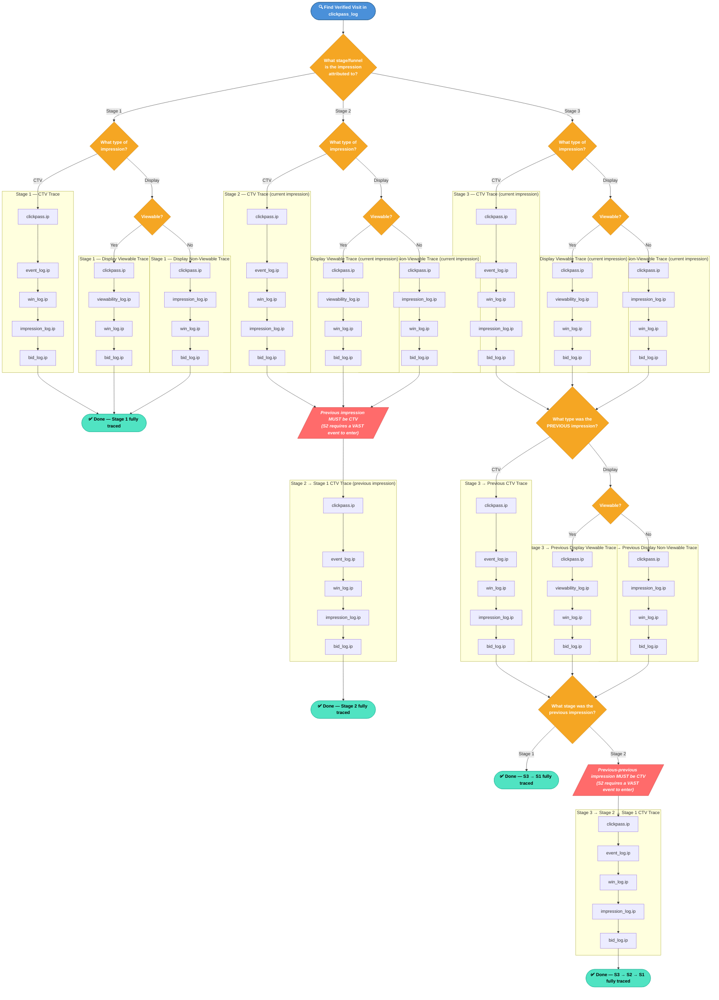

# VV IP Trace Flowchart

```mermaid
flowchart TD
    START([🔍 Find Verified Visit in clickpass_log]) --> STAGE{What stage/funnel<br/>is the impression<br/>attributed to?}

    STAGE -->|Stage 1| S1_TYPE{What type of<br/>impression?}
    STAGE -->|Stage 2| S2_TYPE{What type of<br/>impression?}
    STAGE -->|Stage 3| S3_TYPE{What type of<br/>impression?}

    %% ============================================================
    %% STAGE 1 TRACES
    %% ============================================================
    S1_TYPE -->|CTV| S1_CTV
    S1_TYPE -->|Display| S1_DISP_VIEW{Viewable?}

    subgraph S1_CTV_PATH ["Stage 1 — CTV Trace"]
        S1_CTV[clickpass.ip] --> S1_CTV_2[event_log.ip]
        S1_CTV_2 --> S1_CTV_3[win_log.ip]
        S1_CTV_3 --> S1_CTV_4[impression_log.ip]
        S1_CTV_4 --> S1_CTV_5[bid_log.ip]
    end

    S1_DISP_VIEW -->|Yes| S1_DV
    S1_DISP_VIEW -->|No| S1_DNV

    subgraph S1_DV_PATH ["Stage 1 — Display Viewable Trace"]
        S1_DV[clickpass.ip] --> S1_DV_2[viewability_log.ip]
        S1_DV_2 --> S1_DV_3[win_log.ip]
        S1_DV_3 --> S1_DV_4[bid_log.ip]
    end

    subgraph S1_DNV_PATH ["Stage 1 — Display Non-Viewable Trace"]
        S1_DNV[clickpass.ip] --> S1_DNV_2[impression_log.ip]
        S1_DNV_2 --> S1_DNV_3[win_log.ip]
        S1_DNV_3 --> S1_DNV_4[bid_log.ip]
    end

    S1_CTV_5 --> DONE1([✅ Done — Stage 1 fully traced])
    S1_DV_4 --> DONE1
    S1_DNV_4 --> DONE1

    %% ============================================================
    %% STAGE 2 TRACES
    %% ============================================================
    S2_TYPE -->|CTV| S2_CTV
    S2_TYPE -->|Display| S2_DISP_VIEW{Viewable?}

    subgraph S2_CTV_PATH ["Stage 2 — CTV Trace (current impression)"]
        S2_CTV[clickpass.ip] --> S2_CTV_2[event_log.ip]
        S2_CTV_2 --> S2_CTV_3[win_log.ip]
        S2_CTV_3 --> S2_CTV_4[impression_log.ip]
        S2_CTV_4 --> S2_CTV_5[bid_log.ip]
    end

    S2_DISP_VIEW -->|Yes| S2_DV
    S2_DISP_VIEW -->|No| S2_DNV

    subgraph S2_DV_PATH ["Stage 2 — Display Viewable Trace (current impression)"]
        S2_DV[clickpass.ip] --> S2_DV_2[viewability_log.ip]
        S2_DV_2 --> S2_DV_3[win_log.ip]
        S2_DV_3 --> S2_DV_4[bid_log.ip]
    end

    subgraph S2_DNV_PATH ["Stage 2 — Display Non-Viewable Trace (current impression)"]
        S2_DNV[clickpass.ip] --> S2_DNV_2[impression_log.ip]
        S2_DNV_2 --> S2_DNV_3[win_log.ip]
        S2_DNV_3 --> S2_DNV_4[bid_log.ip]
    end

    S2_CTV_5 --> S2_PREV
    S2_DV_4 --> S2_PREV
    S2_DNV_4 --> S2_PREV

    S2_PREV[/"Previous impression MUST be CTV<br/>(S2 requires a VAST event to enter)"/]

    subgraph S2_PREV_CTV ["Stage 2 → Stage 1 CTV Trace (previous impression)"]
        S2P_CTV[clickpass.ip] --> S2P_CTV_2[event_log.ip]
        S2P_CTV_2 --> S2P_CTV_3[win_log.ip]
        S2P_CTV_3 --> S2P_CTV_4[impression_log.ip]
        S2P_CTV_4 --> S2P_CTV_5[bid_log.ip]
    end

    S2_PREV --> S2P_CTV
    S2P_CTV_5 --> DONE2([✅ Done — Stage 2 fully traced])

    %% ============================================================
    %% STAGE 3 TRACES
    %% ============================================================
    S3_TYPE -->|CTV| S3_CTV
    S3_TYPE -->|Display| S3_DISP_VIEW{Viewable?}

    subgraph S3_CTV_PATH ["Stage 3 — CTV Trace (current impression)"]
        S3_CTV[clickpass.ip] --> S3_CTV_2[event_log.ip]
        S3_CTV_2 --> S3_CTV_3[win_log.ip]
        S3_CTV_3 --> S3_CTV_4[impression_log.ip]
        S3_CTV_4 --> S3_CTV_5[bid_log.ip]
    end

    S3_DISP_VIEW -->|Yes| S3_DV
    S3_DISP_VIEW -->|No| S3_DNV

    subgraph S3_DV_PATH ["Stage 3 — Display Viewable Trace (current impression)"]
        S3_DV[clickpass.ip] --> S3_DV_2[viewability_log.ip]
        S3_DV_2 --> S3_DV_3[win_log.ip]
        S3_DV_3 --> S3_DV_4[bid_log.ip]
    end

    subgraph S3_DNV_PATH ["Stage 3 — Display Non-Viewable Trace (current impression)"]
        S3_DNV[clickpass.ip] --> S3_DNV_2[impression_log.ip]
        S3_DNV_2 --> S3_DNV_3[win_log.ip]
        S3_DNV_3 --> S3_DNV_4[bid_log.ip]
    end

    S3_CTV_5 --> S3_PREV
    S3_DV_4 --> S3_PREV
    S3_DNV_4 --> S3_PREV

    S3_PREV{What type was the<br/>PREVIOUS impression?}

    S3_PREV -->|CTV| S3P_CTV_TYPE
    S3_PREV -->|Display| S3P_DISP_TYPE

    %% --- S3 Previous: CTV path ---
    subgraph S3_PREV_CTV ["Stage 3 → Previous CTV Trace"]
        S3P_CTV_TYPE[clickpass.ip] --> S3P_CTV_2[event_log.ip]
        S3P_CTV_2 --> S3P_CTV_3[win_log.ip]
        S3P_CTV_3 --> S3P_CTV_4[impression_log.ip]
        S3P_CTV_4 --> S3P_CTV_5[bid_log.ip]
    end

    %% --- S3 Previous: Display path ---
    S3P_DISP_TYPE{Viewable?}

    S3P_DISP_TYPE -->|Yes| S3P_DV
    S3P_DISP_TYPE -->|No| S3P_DNV

    subgraph S3P_DV_PATH ["Stage 3 → Previous Display Viewable Trace"]
        S3P_DV[clickpass.ip] --> S3P_DV_2[viewability_log.ip]
        S3P_DV_2 --> S3P_DV_3[win_log.ip]
        S3P_DV_3 --> S3P_DV_4[bid_log.ip]
    end

    subgraph S3P_DNV_PATH ["Stage 3 → Previous Display Non-Viewable Trace"]
        S3P_DNV[clickpass.ip] --> S3P_DNV_2[impression_log.ip]
        S3P_DNV_2 --> S3P_DNV_3[win_log.ip]
        S3P_DNV_3 --> S3P_DNV_4[bid_log.ip]
    end

    S3P_CTV_5 --> S3_PREV_STAGE
    S3P_DV_4 --> S3_PREV_STAGE
    S3P_DNV_4 --> S3_PREV_STAGE

    S3_PREV_STAGE{What stage was the<br/>previous impression?}

    S3_PREV_STAGE -->|Stage 1| DONE3A([✅ Done — S3 → S1 fully traced])
    S3_PREV_STAGE -->|Stage 2| S3_S2_PREV

    S3_S2_PREV[/"Previous-previous impression MUST be CTV<br/>(S2 requires a VAST event to enter)"/]

    subgraph S3_S2_PREV_CTV ["Stage 3 → Stage 2 → Stage 1 CTV Trace"]
        S3S2_CTV[clickpass.ip] --> S3S2_CTV_2[event_log.ip]
        S3S2_CTV_2 --> S3S2_CTV_3[win_log.ip]
        S3S2_CTV_3 --> S3S2_CTV_4[impression_log.ip]
        S3S2_CTV_4 --> S3S2_CTV_5[bid_log.ip]
    end

    S3_S2_PREV --> S3S2_CTV
    S3S2_CTV_5 --> DONE3B([✅ Done — S3 → S2 → S1 fully traced])

    %% ============================================================
    %% STYLING
    %% ============================================================
    classDef startEnd fill:#4a90d9,stroke:#2c5f8a,color:#fff,font-weight:bold
    classDef decision fill:#f5a623,stroke:#c17d12,color:#fff,font-weight:bold
    classDef ctvNode fill:#7ed321,stroke:#5a9e18,color:#000
    classDef dispNode fill:#9013fe,stroke:#6b0fbf,color:#fff
    classDef doneNode fill:#50e3c2,stroke:#2db89e,color:#000,font-weight:bold
    classDef ruleNode fill:#ff6b6b,stroke:#c94444,color:#fff,font-weight:bold,font-style:italic

    class START startEnd
    class STAGE,S1_TYPE,S2_TYPE,S3_TYPE,S1_DISP_VIEW,S2_DISP_VIEW,S3_DISP_VIEW,S3_PREV,S3P_DISP_TYPE,S3_PREV_STAGE decision
    class DONE1,DONE2,DONE3A,DONE3B doneNode
    class S2_PREV,S3_S2_PREV ruleNode
```
