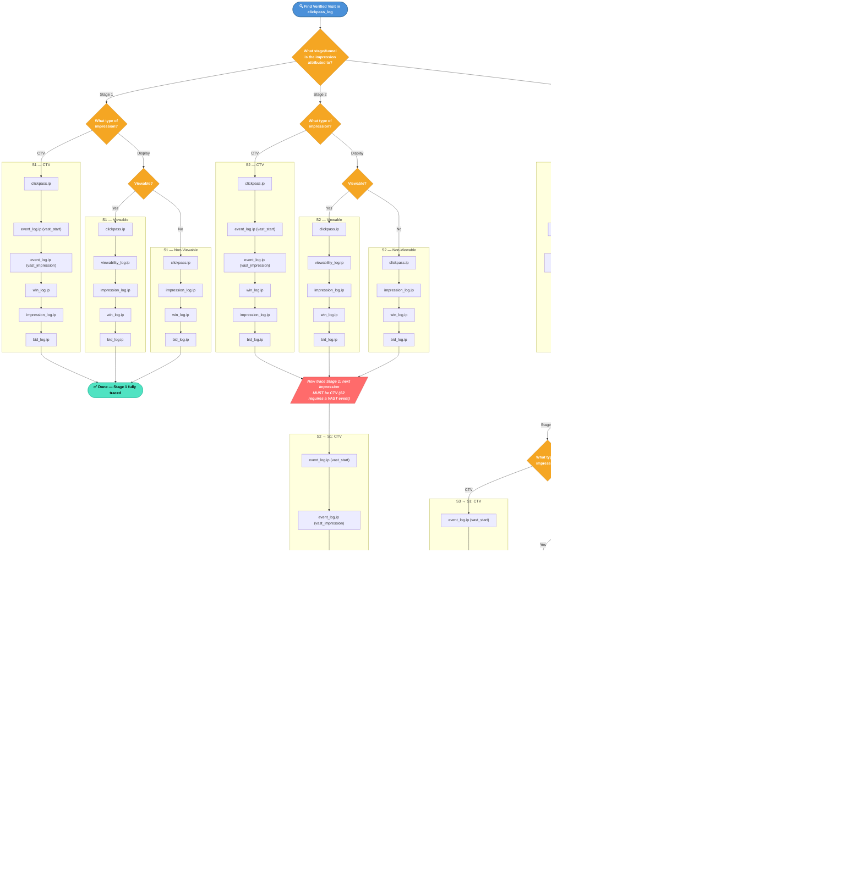

# VV IP Trace Flowchart

```mermaid
flowchart TD
    START([🔍 Find Verified Visit in clickpass_log]) --> STAGE{What stage/funnel<br/>is the impression<br/>attributed to?}

    STAGE -->|Stage 1| S1_TYPE{What type of<br/>impression?}
    STAGE -->|Stage 2| S2_TYPE{What type of<br/>impression?}
    STAGE -->|Stage 3| S3_TYPE{What type of<br/>impression?}

    %% ============================================================
    %% STAGE 1 TRACES
    %% ============================================================
    S1_TYPE -->|CTV| S1_CTV
    S1_TYPE -->|Display| S1_DISP_VIEW{Viewable?}

    subgraph S1_CTV_PATH ["S1 — CTV"]
        S1_CTV[clickpass.ip] --> S1_CTV_2["event_log.ip (vast_start)"]
        S1_CTV_2 --> S1_CTV_2b["event_log.ip (vast_impression)"]
        S1_CTV_2b --> S1_CTV_3[win_log.ip]
        S1_CTV_3 --> S1_CTV_4[impression_log.ip]
        S1_CTV_4 --> S1_CTV_5[bid_log.ip]
    end

    S1_DISP_VIEW -->|Yes| S1_DV
    S1_DISP_VIEW -->|No| S1_DNV

    subgraph S1_DV_PATH ["S1 — Viewable"]
        S1_DV[clickpass.ip] --> S1_DV_2[viewability_log.ip]
        S1_DV_2 --> S1_DV_2b[impression_log.ip]
        S1_DV_2b --> S1_DV_3[win_log.ip]
        S1_DV_3 --> S1_DV_4[bid_log.ip]
    end

    subgraph S1_DNV_PATH ["S1 — Non-Viewable"]
        S1_DNV[clickpass.ip] --> S1_DNV_2[impression_log.ip]
        S1_DNV_2 --> S1_DNV_3[win_log.ip]
        S1_DNV_3 --> S1_DNV_4[bid_log.ip]
    end

    S1_CTV_5 --> DONE1([✅ Done — Stage 1 fully traced])
    S1_DV_4 --> DONE1
    S1_DNV_4 --> DONE1

    %% ============================================================
    %% STAGE 2 TRACES
    %% ============================================================
    S2_TYPE -->|CTV| S2_CTV
    S2_TYPE -->|Display| S2_DISP_VIEW{Viewable?}

    subgraph S2_CTV_PATH ["S2 — CTV"]
        S2_CTV[clickpass.ip] --> S2_CTV_2["event_log.ip (vast_start)"]
        S2_CTV_2 --> S2_CTV_2b["event_log.ip (vast_impression)"]
        S2_CTV_2b --> S2_CTV_3[win_log.ip]
        S2_CTV_3 --> S2_CTV_4[impression_log.ip]
        S2_CTV_4 --> S2_CTV_5[bid_log.ip]
    end

    S2_DISP_VIEW -->|Yes| S2_DV
    S2_DISP_VIEW -->|No| S2_DNV

    subgraph S2_DV_PATH ["S2 — Viewable"]
        S2_DV[clickpass.ip] --> S2_DV_2[viewability_log.ip]
        S2_DV_2 --> S2_DV_2b[impression_log.ip]
        S2_DV_2b --> S2_DV_3[win_log.ip]
        S2_DV_3 --> S2_DV_4[bid_log.ip]
    end

    subgraph S2_DNV_PATH ["S2 — Non-Viewable"]
        S2_DNV[clickpass.ip] --> S2_DNV_2[impression_log.ip]
        S2_DNV_2 --> S2_DNV_3[win_log.ip]
        S2_DNV_3 --> S2_DNV_4[bid_log.ip]
    end

    S2_CTV_5 --> S2_PREV[/"Now trace Stage 1: next impression<br/>MUST be CTV (S2 requires a VAST event)"/]
    S2_DV_4 --> S2_PREV
    S2_DNV_4 --> S2_PREV

    subgraph S2_S1_PATH ["S2 → S1: CTV"]
        S2P_CTV_2["event_log.ip (vast_start)"] --> S2P_CTV_2b["event_log.ip (vast_impression)"]
        S2P_CTV_2b --> S2P_CTV_3[win_log.ip]
        S2P_CTV_3 --> S2P_CTV_4[impression_log.ip]
        S2P_CTV_4 --> S2P_CTV_5[bid_log.ip]
    end

    S2_PREV --> S2P_CTV_2
    S2P_CTV_5 --> DONE2([✅ Done — S2 → S1 fully traced])

    %% ============================================================
    %% STAGE 3 TRACES
    %% ============================================================
    S3_TYPE -->|CTV| S3_CTV
    S3_TYPE -->|Display| S3_DISP_VIEW{Viewable?}

    subgraph S3_CTV_PATH ["S3 — CTV"]
        S3_CTV[clickpass.ip] --> S3_CTV_2["event_log.ip (vast_start)"]
        S3_CTV_2 --> S3_CTV_2b["event_log.ip (vast_impression)"]
        S3_CTV_2b --> S3_CTV_3[win_log.ip]
        S3_CTV_3 --> S3_CTV_4[impression_log.ip]
        S3_CTV_4 --> S3_CTV_5[bid_log.ip]
    end

    S3_DISP_VIEW -->|Yes| S3_DV
    S3_DISP_VIEW -->|No| S3_DNV

    subgraph S3_DV_PATH ["S3 — Viewable"]
        S3_DV[clickpass.ip] --> S3_DV_2[viewability_log.ip]
        S3_DV_2 --> S3_DV_2b[impression_log.ip]
        S3_DV_2b --> S3_DV_3[win_log.ip]
        S3_DV_3 --> S3_DV_4[bid_log.ip]
    end

    subgraph S3_DNV_PATH ["S3 — Non-Viewable"]
        S3_DNV[clickpass.ip] --> S3_DNV_2[impression_log.ip]
        S3_DNV_2 --> S3_DNV_3[win_log.ip]
        S3_DNV_3 --> S3_DNV_4[bid_log.ip]
    end

    S3_CTV_5 --> S3_PREV_STAGE
    S3_DV_4 --> S3_PREV_STAGE
    S3_DNV_4 --> S3_PREV_STAGE

    S3_PREV_STAGE{What stage is the<br/>NEXT impression?}

    %% --- S3 → S1: full type branching ---
    S3_PREV_STAGE -->|Stage 1| S3S1_TYPE{What type of<br/>impression?}

    S3S1_TYPE -->|CTV| S3S1_CTV_2
    S3S1_TYPE -->|Display| S3S1_DISP{Viewable?}

    subgraph S3S1_CTV_PATH ["S3 → S1: CTV"]
        S3S1_CTV_2["event_log.ip (vast_start)"] --> S3S1_CTV_2b["event_log.ip (vast_impression)"]
        S3S1_CTV_2b --> S3S1_CTV_3[win_log.ip]
        S3S1_CTV_3 --> S3S1_CTV_4[impression_log.ip]
        S3S1_CTV_4 --> S3S1_CTV_5[bid_log.ip]
    end

    S3S1_DISP -->|Yes| S3S1_DV_2
    S3S1_DISP -->|No| S3S1_DNV_2

    subgraph S3S1_DV_PATH ["S3 → S1: Viewable"]
        S3S1_DV_2[viewability_log.ip] --> S3S1_DV_2b[impression_log.ip]
        S3S1_DV_2b --> S3S1_DV_3[win_log.ip]
        S3S1_DV_3 --> S3S1_DV_4[bid_log.ip]
    end

    subgraph S3S1_DNV_PATH ["S3 → S1: Non-Viewable"]
        S3S1_DNV_2[impression_log.ip] --> S3S1_DNV_3[win_log.ip]
        S3S1_DNV_3 --> S3S1_DNV_4[bid_log.ip]
    end

    S3S1_CTV_5 --> DONE3A([✅ Done — S3 → S1])
    S3S1_DV_4 --> DONE3A
    S3S1_DNV_4 --> DONE3A

    %% --- S3 → S2: full type branching ---
    S3_PREV_STAGE -->|Stage 2| S3S2_TYPE{What type of<br/>impression?}

    S3S2_TYPE -->|CTV| S3S2_CTV_2
    S3S2_TYPE -->|Display| S3S2_DISP{Viewable?}

    subgraph S3S2_CTV_PATH ["S3 → S2: CTV"]
        S3S2_CTV_2["event_log.ip (vast_start)"] --> S3S2_CTV_2b["event_log.ip (vast_impression)"]
        S3S2_CTV_2b --> S3S2_CTV_3[win_log.ip]
        S3S2_CTV_3 --> S3S2_CTV_4[impression_log.ip]
        S3S2_CTV_4 --> S3S2_CTV_5[bid_log.ip]
    end

    S3S2_DISP -->|Yes| S3S2_DV_2
    S3S2_DISP -->|No| S3S2_DNV_2

    subgraph S3S2_DV_PATH ["S3 → S2: Viewable"]
        S3S2_DV_2[viewability_log.ip] --> S3S2_DV_2b[impression_log.ip]
        S3S2_DV_2b --> S3S2_DV_3[win_log.ip]
        S3S2_DV_3 --> S3S2_DV_4[bid_log.ip]
    end

    subgraph S3S2_DNV_PATH ["S3 → S2: Non-Viewable"]
        S3S2_DNV_2[impression_log.ip] --> S3S2_DNV_3[win_log.ip]
        S3S2_DNV_3 --> S3S2_DNV_4[bid_log.ip]
    end

    S3S2_CTV_5 --> S3S2_S1[/"Now trace Stage 1: next impression<br/>MUST be CTV (S2 requires a VAST event)"/]
    S3S2_DV_4 --> S3S2_S1
    S3S2_DNV_4 --> S3S2_S1

    subgraph S3S2S1_PATH ["S3 → S2 → S1: CTV"]
        S3S2S1_2["event_log.ip (vast_start)"] --> S3S2S1_2b["event_log.ip (vast_impression)"]
        S3S2S1_2b --> S3S2S1_3[win_log.ip]
        S3S2S1_3 --> S3S2S1_4[impression_log.ip]
        S3S2S1_4 --> S3S2S1_5[bid_log.ip]
    end

    S3S2_S1 --> S3S2S1_2
    S3S2S1_5 --> DONE3B([✅ Done — S3 → S2 → S1])

    %% ============================================================
    %% STYLING
    %% ============================================================
    classDef startEnd fill:#4a90d9,stroke:#2c5f8a,color:#fff,font-weight:bold
    classDef decision fill:#f5a623,stroke:#c17d12,color:#fff,font-weight:bold
    classDef ctvNode fill:#7ed321,stroke:#5a9e18,color:#000
    classDef dispNode fill:#9013fe,stroke:#6b0fbf,color:#fff
    classDef doneNode fill:#50e3c2,stroke:#2db89e,color:#000,font-weight:bold
    classDef ruleNode fill:#ff6b6b,stroke:#c94444,color:#fff,font-weight:bold,font-style:italic

    class START startEnd
    class STAGE,S1_TYPE,S2_TYPE,S3_TYPE,S1_DISP_VIEW,S2_DISP_VIEW,S3_DISP_VIEW,S3_PREV_STAGE,S3S1_TYPE,S3S1_DISP,S3S2_TYPE,S3S2_DISP decision
    class DONE1,DONE2,DONE3A,DONE3B doneNode
    class S2_PREV,S3S2_S1 ruleNode
```
