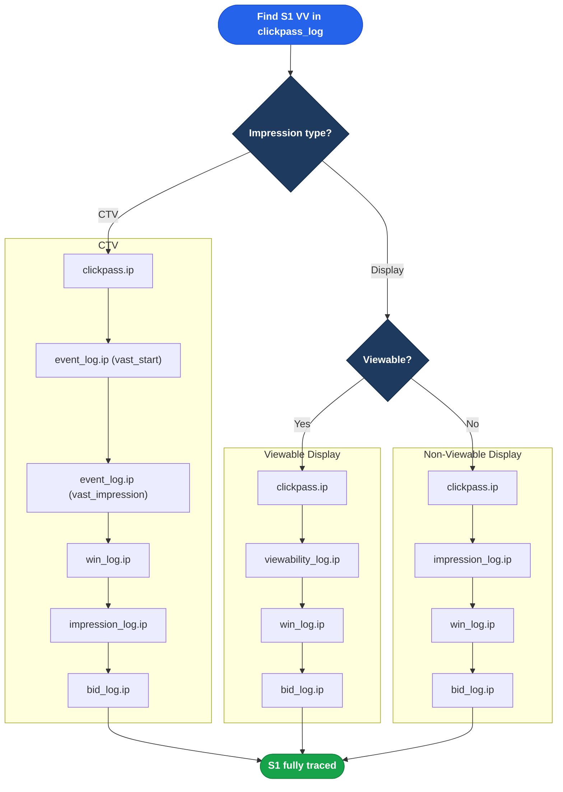
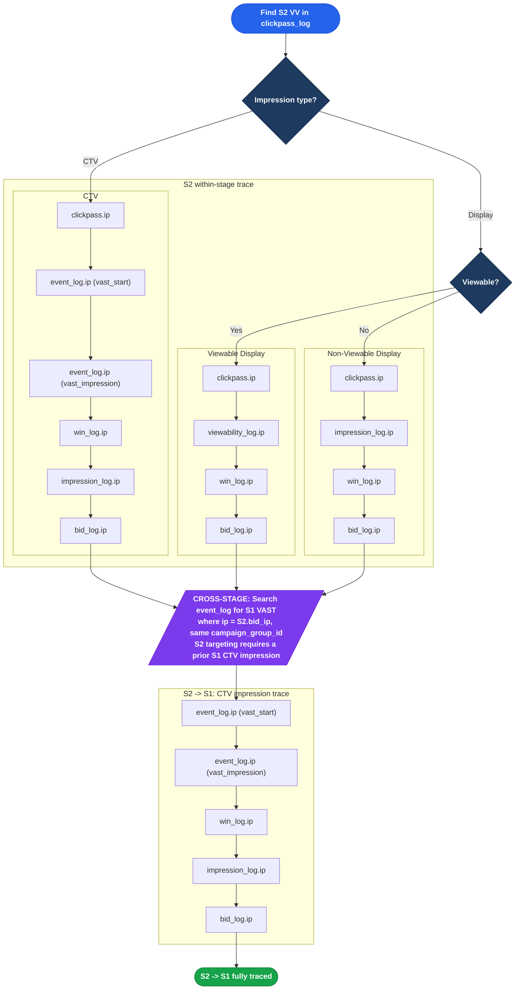
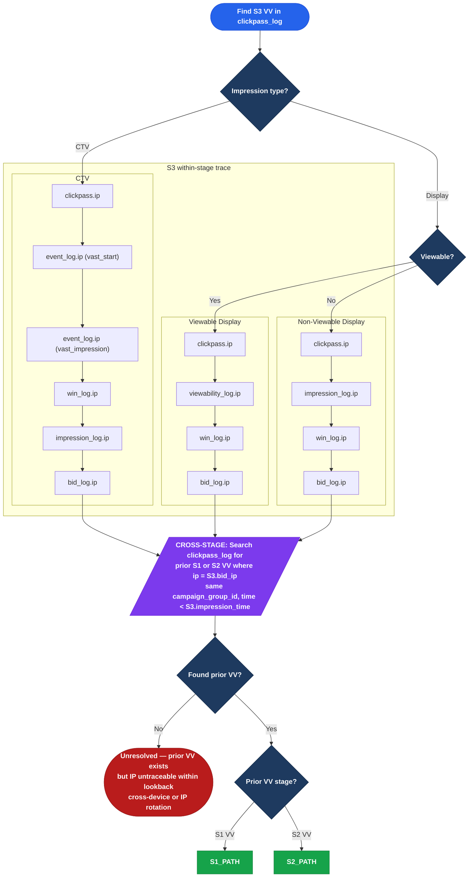
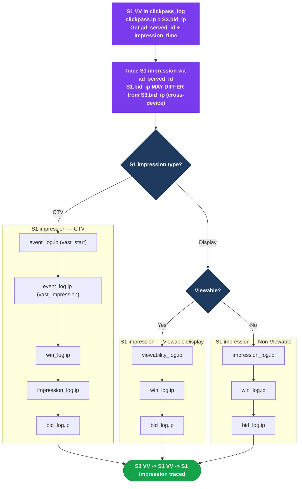
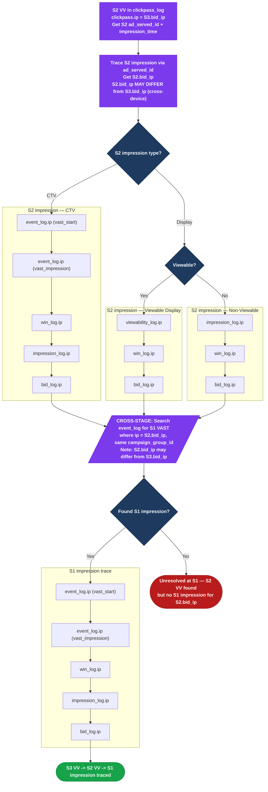

# VV IP Trace Flowchart

Three separate charts — one per stage — for readable PDF export.

**How to read:** Start at the top of the relevant stage. Each node is `table.ip` — trace the IP through the pipeline from clickpass (VV) back to bid. Cross-stage links are called out in rule boxes.

---

## Stage 1: Within-Stage Trace

---

## Stage 2: Within-Stage + Cross-Stage to S1

---

## Stage 3: Within-Stage + Cross-Stage VV Bridge

S3 targeting is **VV-based**: the IP entered S3 because it had a prior S1 or S2 verified visit in the same campaign_group. The cross-stage link is `S3.bid_ip -> clickpass_log.ip` (prior VV), NOT `S3.bid_ip -> event_log.ip`.

### S3 -> S1 VV Path (prior VV was S1)

### S3 -> S2 VV -> S1 Path (prior VV was S2)

