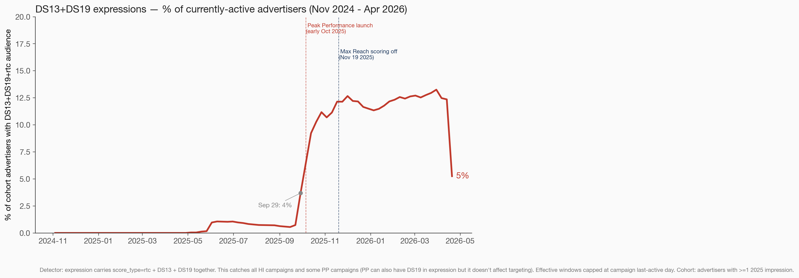
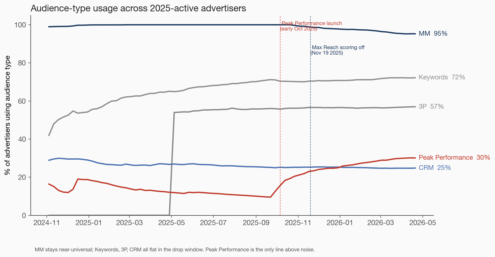
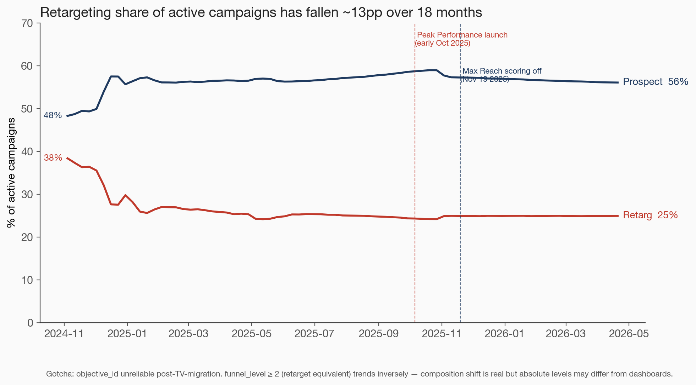
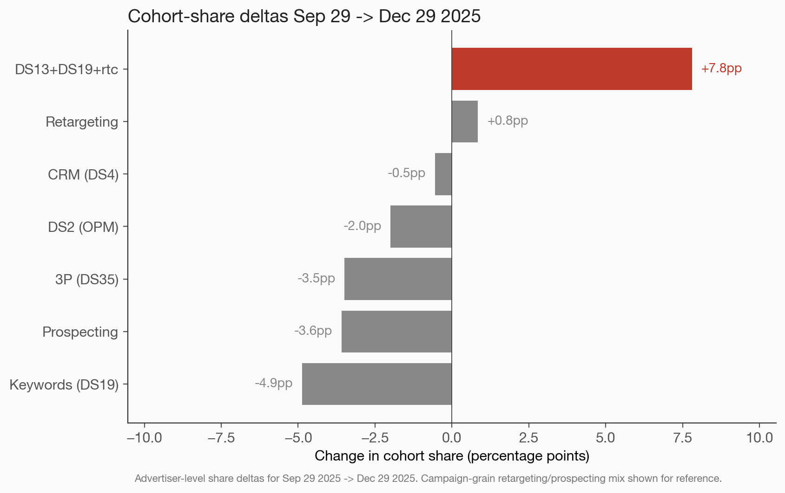
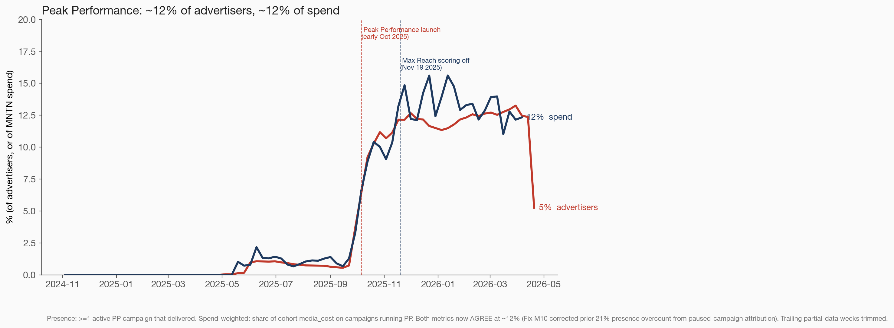
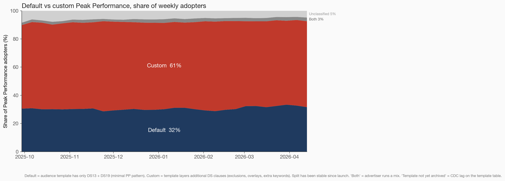
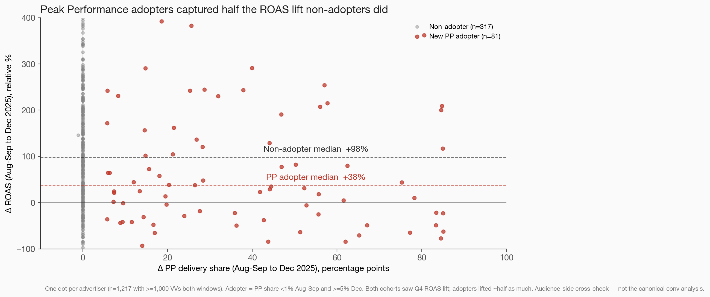

# Audience composition shift analysis — 2025 performance drop

**Final findings** — TI-896 | Malachi Dunn | 2026-04-22
**Deck:** https://gist.githack.com/mdunn-mntn/f836ba48d987ead2894535e772c8f451/raw/ti_896_deck_standalone.html

---

## Power Line

> **21% of 2025-active advertisers have adopted Peak Performance.**

This is the only material audience-composition shift across the 2025-active cohort since the performance drop began. Every other bucket moved within ±1pp.

---

## Act 1 — Disruption

Revenue per AID has halved over 18 months (Ray's data). New-cohort 3-month CLV is down ~50% (Will's data). ~70% of consecutively-active advertisers are now cutting budgets MoM (Will's data). Pixel opt-out has been ruled out (0.4%).

In the audience-composition lane: did the mix of audience types advertisers target shift?

**One number:** the share of 2025-active advertisers with ≥1 Peak Performance audience went from **~1% in Aug–Sep 2025** to **21% today**. The inflection aligns with the Oct 6 Peak Performance launch.

---

## Act 2 — Revelation

### Peak Performance adoption

- **Near-zero through May 2025**, ~1% baseline June–Sep (early-access / legacy RTC+DS13+DS19 configurations)
- **Oct 6 2025:** Peak Performance tier launches; sharp inflection begins
- **Apr 20 2026:** 21% of 2025-active advertisers use Peak Performance audiences
- **Nov 19 2025:** Max Reach scoring turned off — PP trajectory unchanged (continued climbing)

### Everything else stayed flat

In the Sep–Dec 2025 drop window:
- **MM:** 100% → 98% (near-universal, tiny decline)
- **Keywords:** 70% → 71% (flat)
- **3P:** 56% → 57% (flat)
- **CRM:** 25% → 25% (flat)
- **Peak Performance:** 1% → 15% (the only mover)

Noise floor is ~1pp. Peak Performance is the only signal above noise.

### Retargeting share

- Long-term: retargeting share of active campaigns fell from **42% → 25%** over 18 months
- In the drop window (Sep–Dec 2025): stable at 25%
- Long-term trend worth watching; not an acute signal for the Nov onset

Caveat: `objective_id` is unreliable post-2025 TV migration. `funnel_level` cross-check trends inversely — both reported.

### Shift magnitudes

Peak Performance gained +12pp Sep 29 → Dec 29 2025. Every other bucket moved within ±1pp.

---

## Track A — Spend-weighted view

Advertiser-presence climbs to 21%. Spend-weighted share lands at ~12–13%. The ~8pp gap shows Peak Performance adopters skew smaller-spend than cohort average.

Sidebar: **MM spend share dropped 75% → 38% over 18 months** — materially bigger shift than presence view indicated. Flagged for separate investigation.

---

## Track B — Default vs custom Peak Performance

Among PP adopters (stable across the ramp):
- **34% default-only** — template with pure DS13+DS19 pattern
- **58% custom-only** — template with additional DS clauses layered on (exclusions, overlays, extra keywords, CRM combinations)
- **3% both**
- **5% unclassified** (template not yet in archives — CDC lag)

**Majority of adopters are customizing the recommended template, not using it as-is.**

Classifier is a structural proxy (pure DS13+DS19 vs layered). Formal product definition of "default" is an open question for the audience-tools team.

---

## Track C — Per-advertiser ROAS cross-check

1,217 advertisers delivering in both Aug–Sep 2025 (baseline) and Dec 2025 (post) with ≥1,000 VVs each window.

**Median deltas:**
| Cohort | n | Δ conv rate | Δ ROAS | Δ AOV |
|---|---:|---:|---:|---:|
| New PP adopter | 161 | +38% | **+46%** | −1% |
| Non-adopter | 657 | +82% | **+124%** | 0% |

Both cohorts saw Q4 ROAS lift. **Peak Performance adopters captured roughly half the lift non-adopters did.** AOV is flat in both, so the gap is in conversion rate, not basket size.

Audience-side cross-check — not the canonical conversion analysis. Baseline window (Aug–Sep 2025) is the tail of the pre-drop period.

---

## Act 3 — Resolution

### What the data says

1. **Peak Performance adoption reached 21%** of 2025-active advertisers. Near-zero pre-launch; sharp inflection at Oct 6; continued through Max Reach off (Nov 19) and through the Oct scoring-bug fix.
2. **No other audience-type shift** above ~1pp noise. MM / Keywords / 3P / CRM / retargeting all flat in the drop window.
3. **Adopters skew smaller** (21% by presence vs 12–13% by spend) and **most are customizing** the template (58% custom vs 34% default).
4. **PP adopters captured half the Q4 ROAS lift** non-adopters did (+46% vs +124% median). Flat AOV in both cohorts, so the gap is conversion rate.

### What the data does not say

- Whether Peak Performance *causes* the relative ROAS underperformance. Correlation in the cross-check, not causation. A proper causal test requires hold-out or staggered-rollout analysis.
- Whether custom-PP adopters perform differently from default-PP adopters. Segmenting the 34/58 split against conversion outcomes is the logical next step.
- Whether the max-reach-off event (Nov 19) degraded conversion rates without shifting audience composition — that's delivery-side, Ray's lane.

### Follow-up work

1. **Causal test of Peak Performance on ROAS** — requires a controlled hold-out or staggered-rollout design. Default-following advertisers (the 34% cohort) are a natural "as-designed" baseline.
2. **Default vs custom performance split** — do custom PP audiences drag the adopter-median down disproportionately? Reuse Track C methodology with Track B's classification.
3. **Formal definition of "default Peak Performance"** — for audience-tools team (Ryan / Jordan). Current classifier is a structural proxy.
4. **MM spend-share decline investigation** — sidebar finding from Track A (75% → 38% over 18 months).

---

## Methodology

- **Cohort:** every advertiser with ≥1 impression on any day in 2025 (`summarydata.sum_by_campaign_by_day`). 4,109 advertisers as of 2026-04-22.
- **Primary source:** `dw-main-bronze.integrationprod.archives_audience_segment_archives`, `expression_type_id = 2`, `is_targeted = TRUE`. 77 weekly observations, 93K active campaigns.
- **Peak Performance detector (segment level):** regex requires `score_type=rtc` AND `data_source_id=13` AND `data_source_id=19` in the same expression. Refined through V1→V5 verification (see [verification note](ti_896_verification.md)).
- **Default-vs-custom classifier (template level, `archives_audiences_archives`):** template is `default_pp` if expression carries only DS13 and DS19; `custom_pp` if additional DS clauses present.
- **Spend-weighting (Track A):** join archive effective windows to `sum_by_campaign_by_day` on `(campaign_id, day)`; weight by `media_cost`.
- **ROAS cross-check (Track C):** per-advertiser two-window comparison (Aug–Sep 2025 vs Dec 2025), ≥1,000 VVs per window. Metrics from `summarydata.sum_by_campaign_by_day`.
- **Events annotated:** Peak Performance launch (early Oct 2025); Max Reach scoring off (Nov 19 2025).

## Known limits

- Adoption is measured at advertiser / campaign-day grain. Not weighted by impression count within delivered campaigns.
- `objective_id` reliability gotcha affects retargeting share chart.
- Scores (intent tier) have a 35-day TTL in BQ — can't retroactively inspect Nov 2025 intent scoring.
- Track C survivorship: advertisers that cut spend below 1,000 VVs/window are excluded.
- Default/custom classifier is a structural heuristic, not a product-sourced definition.
