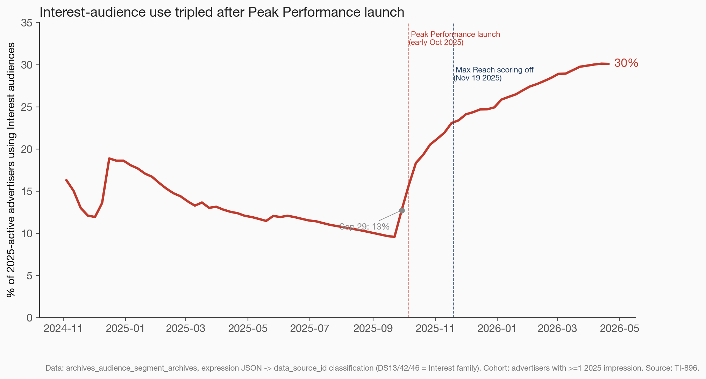

# Audience composition shift analysis — 2025 performance drop

**Initial findings** — TI-896 | Malachi | 2026-04-22

---

## Power Line

> **Interest-audience use tripled the week Peak Performance launched.**

This is the only material composition shift across 2025-active advertisers in the drop window. Every other audience-type mix moved within ±2pp.

---

## Act 1 — Disruption

Revenue per AID has halved over 18 months (Ray). New-cohort 3-month CLV is down ~50% (Will). 70% of consecutively-active advertisers are now cutting budgets MoM (Will). Pixel opt-out has been ruled out.

Richard's ask from our lane: **did the mix of audience types advertisers target shift?** If yes, in which direction, when, and by how much.

**One number:** the share of 2025-active advertisers running at least one Interest audience went from **13% on Sep 29** to **30% today**. The inflection point is the week Peak Performance shipped. Every other composition metric moved within ±2pp.

---

## Act 2 — Revelation

### Slide 2.1 — The inflection

- **Sep 29 2025:** 13% of active advertisers used Interest audiences (flat line for 9 months prior)
- **Oct 6 2025:** Peak Performance tier launches
- **Apr 22 2026:** 30% of active advertisers use Interest audiences
- **Nov 19 2025:** Max Reach scoring turned off — Interest trajectory unchanged (continued climbing)

### Slide 2.2 — Everything else is flat

In the drop window (Sep 2025 → Dec 2025):
- MM: 100% → 99.5% (flat — every advertiser uses it)
- 3P: 71% → 69% (–2pp)
- CRM: 25% → 25% (flat)
- **Interest: 10% → 25% (+15pp)**

The noise floor is ~2pp. Interest is the only signal above noise.

### Slide 2.3 — Retargeting share (Alex's hypothesis)

Alex Knorr's hypothesis: "if advertisers are setting up fewer retargeting campaigns, that could explain conversion drops."

- Long-term: retargeting share fell from **38% → 25%** over 18 months (Nov 2024 → today)
- In the drop window specifically (Sep–Dec 2025): stable at 25%
- Long-term trend worth watching, but not the acute signal for the Nov 2025 drop

Caveat: `objective_id` is unreliable post-2025 TV migration (known gotcha). `funnel_level` cross-check trends inversely — we report both.

### Slide 2.4 — Shift magnitudes

Interest audiences gained +12pp in three months. Every other bucket moved within ±1pp.

---

## Act 3 — Resolution

### What the data says

1. **One material composition shift** in the 2025 drop window: Interest-audience adoption tripled, starting the week Peak Performance launched.
2. **No corroborating move on MM, 3P, CRM, or prospecting/retargeting mix** during the drop window — those aren't the story.
3. **Max Reach off (Nov 19)** did not visibly bend Interest adoption or any other curve — the Peak Performance ramp continued smoothly through it.

### What the data doesn't say

- Whether Peak Performance adoption *caused* the conversion fall. Rev-per-AID was already declining in 2024, long before Peak Performance shipped — Interest's ramp is *one* moving piece inside a system-wide contraction. Requires advertiser-level joins against Ray's conversion deltas and Will's spend-velocity data to go further.
- Whether default Peak Performance recommendations differ from what advertisers shipped — requires default-vs-custom analysis (queued).
- Whether max-reach-off hurt conversion rates even while leaving audience composition unchanged — delivery/performance side, owned by Ray's team.

### Next steps (ranked)

1. **Advertiser-level scatter:** Δ(Interest share) vs Δ(conversion rate), Sep–Dec 2025. If advertisers who adopted Peak Performance saw larger conversion declines, that's the smoking gun. *(Planned tomorrow.)*
2. **Default-vs-custom cut:** how many of these Interest audiences are the MNTN-provided defaults vs. advertiser-built variants. *(Planned tomorrow; Malachi + Alex Knorr agreed this angle in today's meeting.)*
3. **Peak Performance scoring sanity check:** compare October 2025 (launch + scoring bug) vs Nov–Dec 2025 (post-fix). If Interest-audience campaigns under-delivered conversions specifically in that period, the analysis escalates.

---

## Methodology

- **Cohort:** every advertiser with ≥1 impression on any day in 2025 (`summarydata.sum_by_campaign_by_day`)
- **Source:** `dw-main-bronze.integrationprod.archives_audience_segment_archives`, `expression_type_id = 2`, `is_targeted = TRUE`. 77 weeks, 4,111 advertisers, 93K active campaigns as of Apr 22 2026.
- **Classifier:** regex-extract `data_source_id` values from expression JSON → join to canonical `data_sources` dim → bucket to war-room categories (MM / 3P / CRM / Interest / RTC Keywords / Extension / Exclusion).
  - MM = DS19 (MNTN Matched) + DS2 (MNTN First Party) + per-advertiser "First Party Audience" sources
  - 3P = DS1/3/11/17/18/20/22/29/33/35 + other vendor sources + per-advertiser "Third Party Audience"
  - CRM = DS4 + DS31 + DS47
  - Interest = DS13/42/46 (Peak Performance family)
- **Time reconstruction:** per `(campaign_id)`, `LEAD(update_time)` gives each version an effective window; we explode to weeks and roll up.
- **Events annotated:** Peak Performance launch (early Oct 2025, Mike Dolt); Max Reach scoring off (Nov 19 2025, Ryan Kleck).

## Known limits

- We count *presence* of each DS type in any active campaign expression. We don't yet weight by spend or impression share — a campaign with a Peak Performance clause attached but zero delivery still counts. Delivery-weighted view requires joining archive windows to daily spend (planned tomorrow).
- `objective_id` reliability gotcha noted on the retargeting slide.
- Scores themselves have a 35-day TTL in BQ — we cannot retroactively look at Nov 2025 intent scores for a conversion-correlation analysis.
