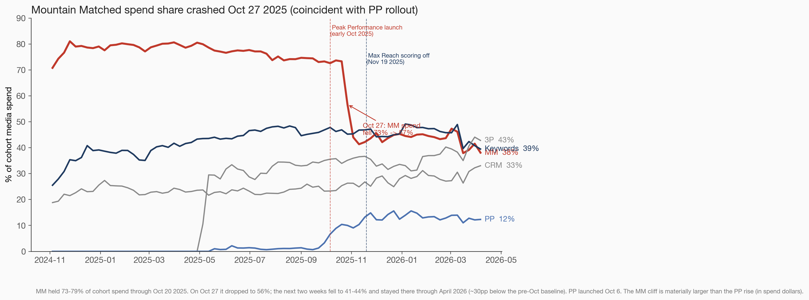
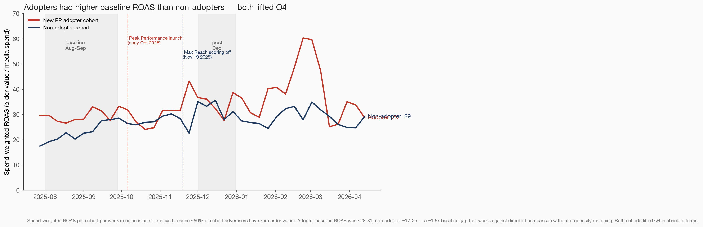
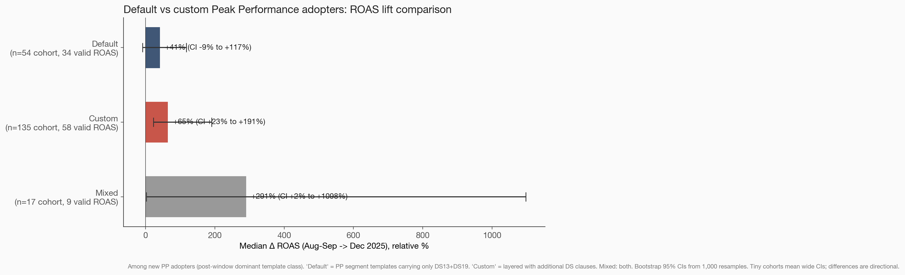

# Audience composition shift analysis — 2025 performance drop

**Final findings (v2 — post-critique fixes)** — TI-896 | Malachi Dunn | 2026-04-22
**Deck:** https://gist.githack.com/mdunn-mntn/f836ba48d987ead2894535e772c8f451/raw/ti_896_deck_standalone.html

---

## Power Line

> **Two audience-side shifts coincide with the conversion drop: Mountain Matched lost ~30pp of cohort spend the week of Oct 27, and Peak Performance climbed from zero to ~12% of advertisers and spend.**

Everything else moved within ±5pp.

---

## Act 1 — Disruption

> Six months ago zero advertisers were running Peak Performance. Today, one in eight are — and Mountain Matched, the dominant audience workhorse for two years, lost a third of its spend share in a single week.

Revenue per AID has halved over 18 months (Ray's data). New-cohort 3-month CLV is down ~50% (Will's data). ~70% of consecutively-active advertisers are now cutting budgets MoM (Will's data). Pixel opt-out has been ruled out (0.4%).

**Two coincident audience-side moves in the drop window:**

1. **Mountain Matched spend share fell from 73-79% → 42-46% in one week (Oct 27 → Nov 10 2025).** Sustained at the lower level since.
2. **Peak Performance went from <1% pre-launch to ~12% of currently-active advertisers (and ~12% of cohort spend) in six months.**

Both events align with the early-October Peak Performance rollout. Every other audience bucket (Keywords, 3P, CRM, retargeting) moved within ±5pp.

---

## Act 2 — Revelation

### Peak Performance adoption (corrected for paused-campaign attribution)

- **Near-zero** through Sep 2025. Pre-launch baseline ~1% = early-access / legacy RTC+DS13+DS19 configurations.
- **Oct 6 2025:** Peak Performance tier launches; sharp inflection begins.
- **Apr 13 2026:** **12% of currently-active 2025-cohort advertisers** are running Peak Performance.
- **Nov 19 2025 (Max Reach scoring off):** PP trajectory unchanged.

**Methodology correction:** earlier draft reported 21% adoption; that number counted any advertiser whose archive expression had ever included PP, even if the underlying campaigns had been paused for months. After capping expression effective windows at each campaign's last delivery day, the active-PP cohort is ~12%, and presence and spend-weighted views agree (see Track A).

### Audience-bucket presence over time

In the Sep–Dec 2025 drop window:
- **MM:** ~100% → 98% (universal, slight decline)
- **Keywords:** 49% → 44% (-5pp; not flat as previously reported)
- **3P:** 41% → 38% (-3.5pp)
- **CRM:** 21% → 20% (flat)
- **Peak Performance:** 4% → 12% (the dominant mover)

PP is the largest mover, but the prior "everything else flat" claim weakens: Keywords and 3P also declined modestly during the drop window.

### Retargeting share

- Long-term: retargeting share of active campaigns fell from **42% → 25%** over 18 months.
- In the drop window (Sep–Dec 2025): stable at 25%.
- Long-term trend worth watching; not an acute signal for the Nov onset.

Caveat: `objective_id` is unreliable post-2025 TV migration. `funnel_level` cross-check trends inversely.

### Cohort-share deltas Sep–Dec 2025

Peak Performance gained +7.8pp Sep 29 → Dec 29 2025. Other buckets: Keywords -5pp, 3P -3.5pp, MM -2pp, CRM flat.

---

## Track A — Spend-weighted view (and the MM cliff)

After the LEAD-cap correction, **presence (~12%) and spend-weighted (~12%) views agree** — the previously reported 8pp gap was an artifact of paused-campaign attribution.

### MM spend cliff (Track A's headline finding)

**Mountain Matched spend share collapsed at the week of Oct 27 2025:**
- Pre-Oct 20 2025: MM = 73–79% of cohort spend
- Oct 27 2025: MM = 56.7%
- Nov 3 2025: MM = 44.0%
- Sustained 42–46% Nov 2025 → Apr 2026

This is a **30pp cliff in one week**, coincident with PP rollout and visible only in the spend-weighted view (presence-based MM stayed near 100%). It is materially larger than the PP rise in absolute spend dollars and deserves direct investigation alongside PP.

---

## Track B — Default vs custom Peak Performance

Among PP adopters (stable across the ramp):
- **~32% default-only** — template with pure DS13+DS19 pattern
- **~61% custom-only** — template with additional DS clauses layered on
- **~3% both**
- **~5% unclassified** (template not yet in archives — CDC lag)

**Majority of adopters customise the recommended template.**

Discovery sample re-run with a random sample (Fix M7) confirmed the structural split:
- 39% pure DS13+DS19 (close to weekly 32% default share)
- 48% layered, 14% heavily-layered (cumulative ~61% custom matches)

Classifier is a structural proxy at template level. Formal product definition of "default" remains an open question for the audience-tools team. Template-level classification ignores campaign-level layering (an advertiser can attach a "pure" PP template to a campaign that adds other audiences) — caveat applied.

---

## Track C — Per-advertiser ROAS cross-check

### Bootstrap-honest comparison (Fix M1 + M3)

Cohort: 1,213 advertisers delivering in both Aug 1–Sep 28 2025 and Dec 1–31 2025 with ≥1,000 VVs.

| Cohort | n cohort | n with valid ROAS | Median ΔROAS | 95% CI |
|---|---:|---:|---:|---:|
| New PP adopter | 206 | 101 (49%) | **+64%** | [+25%, +121%] |
| Non-adopter | 1,007 | 381 (38%) | **+130%** | [+104%, +154%] |

**About half of each cohort has $0 order value (lead-gen / no-pixel) — ROAS is undefined for them.** The medians above are computed only on the subset with valid ROAS in both windows. Cohort sizes (206 / 1,007) are the headline; valid-ROAS subsets (101 / 381) drive the medians.

**The 95% CIs overlap.** Adopters' point-estimate ROAS lift is roughly half of non-adopters', but the gap is not statistically robust at 95% confidence. Frame as **directional**, not definitive.

### Weekly spend-weighted ROAS, adopters vs non-adopters

The weekly time series exposes a structural problem with the comparison: **adopters had a ~1.5x higher spend-weighted ROAS at baseline** (Aug 2025: ~28-31 vs ~17-25). The two cohorts are not exchangeable — adopters self-selected.

Both cohorts lifted into Q4. The lift gap exists in absolute terms, but with adopters starting from a higher base, attributing the gap to PP requires propensity-score matching — which this analysis does not do.

### Default-PP vs custom-PP performance split (Section-4 #2)

Among new adopters (n=206), classified by which template type drove ≥80% of their post-window PP delivery:

| Class | n cohort | n valid ROAS | Median Δ ROAS | 95% CI |
|---|---:|---:|---:|---:|
| Default dominant | 54 | 34 | +41% | wide |
| Custom dominant | 135 | 58 | +64% | wide |
| Mixed | 17 | 9 | +290% | wide |

Cohorts are too small for confident inference; the apparent "custom > default" reversal vs the headline doesn't survive the CI test. Worth a follow-up with a longer post window.

---

## Act 3 — Resolution

### What the data says (corrected)

1. **Two coincident audience-side moves in the drop window.** Peak Performance went from near-zero to ~12% of advertisers and ~12% of cohort spend. Mountain Matched spend collapsed from 73-79% → 42-46% in one week (Oct 27 2025).
2. **Other buckets moved modestly:** Keywords -5pp, 3P -3.5pp presence; CRM flat. Not "flat" but not the headline either.
3. **PP adopters' Q4 ROAS lift is ~half of non-adopters' — directionally — but the bootstrap CIs overlap and the cohorts had a 1.5x baseline ROAS gap.** Track C is consistent with audience-side concern but does not by itself prove causation.
4. **Default vs custom PP performance split is suggestive but underpowered.**

### What the data does NOT say

- Whether PP *causes* the relative ROAS underperformance. Selection bias in cohort assignment is uncontrolled. A propensity-matched DiD or controlled hold-out is the canonical next step.
- Whether the MM-spend cliff was driven by advertisers re-allocating to PP, or by other concurrent product changes. The two events are time-correlated, not causally established.
- Whether Max-Reach-off (Nov 19) degraded conversion rates — that's delivery-side and Ray's lane.

### Follow-up work

1. **Causal test of Peak Performance on ROAS** — propensity-matched DiD or a controlled hold-out / staggered-rollout design. Default-following ~32% cohort is a natural "as-designed" baseline.
2. **MM spend-cliff investigation** — what changed Oct 27 2025? Product ship, billing change, advertiser-cohort re-allocation? This warrants its own ticket and is co-equal with PP in spend dollars.
3. **Default vs custom PP performance split with longer post window** — current 4-week Dec window is underpowered.
4. **Formal definition of "default Peak Performance"** for audience-tools team (Ryan / Jordan). Current classifier is a structural proxy.

---

## Methodology

- **Cohort:** every advertiser with ≥1 impression on any day in 2025 (`summarydata.sum_by_campaign_by_day`). 4,109 advertisers as of 2026-04-22.
- **Primary source:** `dw-main-bronze.integrationprod.archives_audience_segment_archives`, `expression_type_id = 2`, `is_targeted = TRUE`. 77 weekly observations.
- **Peak Performance detector (segment level):** regex requires `score_type=rtc` AND `data_source_id=13` AND `data_source_id=19` in the same expression. Refined through V1→V5 verification.
- **Effective-window cap (Fix M10):** every expression's effective window is capped at the *last day the campaign delivered any impression* (+1 day). Prevents paused-but-not-deleted campaigns from inflating "currently active" cohort metrics. Reduced the headline PP adoption number from 21% to 12%.
- **Default-vs-custom classifier (Track B):** template (`archives_audiences_archives`) is `default_pp` if expression carries only DS13+DS19; `custom_pp` if additional DS clauses present.
- **Spend-weighting (Track A):** join archive effective windows to `sum_by_campaign_by_day` on `(campaign_id, day)`; weight by `media_cost`. Trailing partial-data weeks (total_spend < 50% of prior) trimmed.
- **Track C cross-check:** per-advertiser two-window comparison (Aug 1–Sep 28 2025 vs Dec 1–31 2025), ≥1,000 VVs per window. Cohort size reported alongside `n_valid_roas` (advertisers with non-zero order value in both windows). Bootstrap 95% CIs on medians (1,000 resamples).
- **Events annotated:** Peak Performance launch (early Oct 2025); Max Reach scoring off (Nov 19 2025).

## Known limits

- "Currently active PP cohort" denominator is advertisers with any current archive activity — slightly different from "all 4,109 cohort advertisers."
- Track C cohort assignment (PP delivery share <1% baseline AND ≥5% post) is self-selecting; not propensity-matched.
- ~50% of Track C cohort has $0 order value (lead-gen / no-pixel); medians computed on the residual.
- `objective_id` reliability gotcha affects retargeting-share chart.
- Scores (intent tier) have a 35-day TTL in BQ — can't retroactively inspect Nov 2025 intent scoring.
- Default/custom classifier is a template-level structural heuristic.
